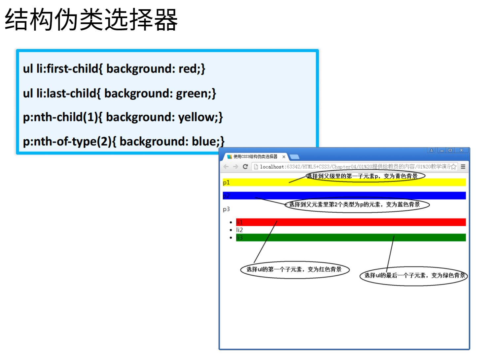
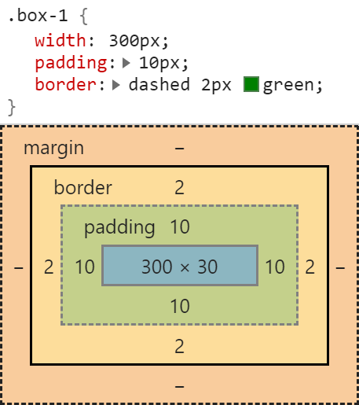

# <center> Lecture02 HTML & CSS (Part 2) </center>

本篇笔记以 Ally 老师的 Lecture 02 HTML & CSS (Part 2) 为框架，根据 W3School 和 MDN 进行补充，旨在辅以 23 期全栈视频，帮助同学建立起基本的学习框架。

欲了解更多实际操作和详细内容，请参考附带的文档。

## <center>目录</center>

[CSS - Cascading Style Sheets](#css-cascading-style-sheets)

- [CSS Introduction](#css-introduction)
- [How to Add CSS into HTML](#how-to-add-css-into-html)
- [CSS Selectors](#css-selectors)
- [CSS Selectors Advanced Skills](#css-selectors-advanced-skills)
- [Font and Text Style](#font-and-text-style)
- [Inline and Block](#inline-and-block)
- [Background Property](#background-property)
- [CSS 的三大特性](#css的三大特性)
- [CSS 盒模型 (Box Model)](#css盒模型-box-model)
- [Flex 布局](#flex布局)

---

## <center>CSS - Cascading Style Sheets</center><br>

Reference Document: [MDN](https://developer.mozilla.org/en-US/docs/Web/CSS),
[W3school](https://www.w3schools.com/css/)

### CSS Introduction

基本概念

- 定义：CSS (级联样式表) 是用来装饰和布局网页的语言，描述了 HTML 元素如何在屏幕、纸张或其他媒体上显示

- 作用：让网页内容更加美观，为 HTML 元素设置样式。
- 语法：<br><br>
  &emsp;&emsp; - 用选择器找到想要设置样式的 HTML 元素。 - 声明块包含一个或多个以分号分隔的声明。 - 每个声明都包含一个 CSS 属性名称和一个值（键值对），以冒号分隔。 - 多个 CSS 声明用分号分隔，声明块用大括号括起来。

CSS Comments:

```css
/* This is a single-line comment 单行注释*/

/* This is
a multi-line
comment 
多行注释*/
```

Emmet

> [Emmet](https://code.visualstudio.com/docs/editor/emmet)：一个高效的编码快捷工具，帮助快速编写 HTML/CSS。  
> Example：输入`ul>li*5`后，可快速展开为 5 个列表项的无序列表。  
> Reference Document: [Emmet](https://code.visualstudio.com/docs/editor/emmet)

### How to Add CSS into HTML

Three Ways to Insert CSS

- Internal CSS：直接在 HTML 文件的`<head>`中使用`<style>`标签。
  ```html
  <!DOCTYPE html>
  <html>
    <body>
      <h1 style="color:blue;text-align:center;">This is a heading</h1>
      <p style="color:red;">This is a paragraph.</p>
    </body>
  </html>
  ```
  > 提示：内联样式失去了样式表的许多优点（通过将内容与表示混合在一起）。谨慎使用此方法。
- Inline CSS：直接在 HTML 元素上使用 style 属性。
  ```html
  <h1 style="color:red;">标题</h1>
  ```
- External CSS（**最佳实践**）：通过.css 文件链接到 HTML，使样式与内容分离。此为最佳实践。

  ```html
  <html>
    <head>
      <link rel="stylesheet" href="mystyle.css" />
    </head>
    <body></body>
  </html>
  ```

### CSS Selectors

- 元素选择器：针对特定 HTML 标签应用样式，如:
  ```css
  h1 {
    /*选择所有h1标签*/
    text-align: center;
    color: red;
  }
  ```
- 类选择器：`.classname`一个或多个 HTML 元素的自定义样式
  - 一个元素可以应用多个类名，如：`<div class="class1 class2">`
  - HTML 元素也可以引用多个类，如：
    ```html
    <div class="class1">
      <div class="class1"></div>
    </div>
    ```
    > 注意：类名不能以数字开头！
- ID 选择器：针对特定 id 的 HTML 元素应用样式。是唯一的。  
  Example:

  ```css
  #idname {
    text-align: center;
    color: red;
  }
  ```

- 通配符选择器：选取所有元素应用统一样式。
  ```css
  * {
    margin: 0;
    padding: 0;
  }
  ```
  > 在 css 中`.class`用的比`#id`多

### CSS Selectors Advanced Skills

- 后代选择器，如：

  ```css
  /*选择所有div内的p后代元素*/
  div p {
    ...;
  }
  ```

- 子元素选择器，如：

  ```css
  /*只选择div的直接子元素p*/
  div > p {
    ...;
  }
  ```

- 并集选择器，如：

  ```css
  /*可以同时为多个标签设置样式*/
  h1,
  h2,
  h3 {
    ...;
  }
  ```

- 交集选择器，如:
  ```css
  /* 选中：类名同时包含card和card1的元素 */
  .card.card1 {
    color: green;
  }
  ```
- 链接伪类选择器，用于定义链接或其他元素在不同状态下的样式  
   Example:

  ```css
  <style>
      /* 未访问过的链接 a:link */
     a:link {
      color:red
     }
      /* 访问过的链接 a:visited */
     a:visited {
      color: orange;
     }
      /* 鼠标经过的链接 a:hover */
     a:hover {
      color:skyblue
     }
      /* 鼠标按下还没有弹起的链接 a:active */
    a:active{
      color:green;
    }
  </style>
  ```

- 结构伪类选择器：  
  

### CSS Font and Text Style

- 字体属性：如:`font-family`, `font-style`, `font-size`, `font-weight`等。

  - `font-family` 属性设置字体类型，常见属性值:
    - Serif fonts
    - Sans-serif fonts
    - Monospace fonts
  - `font-style` 属性设置字体风格，常见属性值:
    - normal
    - italic
    - oblique
  - The `font-weight` 属性字体粗，常见属性值
    - lighter
    - normal
    - bold
    - bolder（多数字体不支持）
  - The `font-size` property sets the size of the text.

- 文本样式属性名：常见用于控制文本的显示效果的属性名：
  - `text-align`: 设置文字居中，左对齐，右对齐，文字拉伸等
  - `vertical-align`:用于指定同一行元素之间，或 表格单元格 内文字的 垂直对齐方式。
  - `text-decoration`: Sets all the text-decoration properties in one declaration
  - `text-decoration-line`: Specifies the kind of text decoration to be used (underline, overline, etc.)
  - `text-decoration-color`: Specifies the color of the text-decoration
  - `text-decoration-style`: Specifies the style of the text decoration (solid, dotted, etc.)
  - `text-decoration-thickness`: Specifies the thickness of the text decoration line
  - `text-transform`: Controls the capitalization of text
  - `letter-spacing`: Specifies the space between characters in a text
  - `line-height`: Specifies the line height
  - `text-indent`: Specifies the indentation of the first line in a text-block
  - `white-space`: Specifies how to handle white-space inside an element
  - `word-spacing`: Specifies the space between words in a text
  - `text-shadow`: Specifies the shadow effect added to text

> 很多 css 属性可以设置复合属性：例如 `font: 12px Arial, sans-serif;`可以一次性设置多个字体相关的属性。

### Inline and Block

- 块元素 block：如 `div`，独占一行。可以通过 CSS 设置宽高。
- 行内元素 inline：如 `span`，不独占一行。无法通过 CSS 设置宽高。
- 行内块元素（inline-block）：可以通过 CSS 设置宽高。
  

元素模式转化：使用 display 属性，如
`display: block;`, `display: inline;`, `display: inline-block;`

### Background Property

- `background-color:red` 设置背景颜色
- `background-image: url("paper.gif");` 设置背景图片
- `background-repeat` 设置背景重复方式，常见属性值：
  - repeat
  - repeat-x
  - repeat-y
  - no-repeat
- `background-position` 设置背景图位置<br><br>
  > `background` 也可以使用复合属性

### CSS 的三大特性

1. 层叠性：当有多个相互冲突的样式规则时，哪一个会生效。
   - 如果发生了样式冲突，那就会根据一定的规则（选择器优先级）样式的层叠。
2. 继承性：某些样式会被子元素继承。
3. 优先级 & 权重叠加：

   - Inline style > Internal style sheets > External style sheets
   - !important (慎用) > 行内样式 > ID 选择器 > 类选择器 > 元素选择器 > 通配选择器。
   - 权重的计算（ID 选择器的个数，类、伪类、属性 选择器的个数，元素、伪元素 选择器的个数。）然后从左到右依次对比。比如：

   ```css
   #example {
     color: green; /* 1-0-0  - WINS!! */
   }

   .bodyClass .sectionClass .parentClass [id="myElement"] {
     color: yellow; /* 0-4-0 */
   }
   ```

### CSS 盒模型 (Box Model)



内容(content) ：盒子内部内容

内边距(padding)

- 可以通过各种属性修改内边距的样式：`padding-top: 10px`， `padding-right: 20px`，`padding-bottom: 30px`，`padding-left: 40px`
- 也可以写成符合属性 `padding: 10px 20px 30px 40px;`

边框(border)：

- 可以通过各种属性修改边框的样式，粗细和颜色等：如`border-style: solid;`，`border-width: 1px;`，`border-color: black;`
- 也可以写成符合属性如:`border: 1px solid black;`

外边距(margin)：

- CSS 具有指定元素每一侧边距的属性：
  - margin-top
  - margin-right
  - margin-bottom
  - margin-left
- 所有边距属性都可以具有以下值：
  - auto - 浏览器计算边距
  - length - 指定边距，单位为 px、pt、cm 等。
  - % - 以包含元素宽度的 % 为单位指定边距
  - 继承 - 指定边距应从父元素继承
- 提示：允许负值。

```css
#example {
  margin-top: 100px;
  margin-bottom: 100px;
  margin-right: 150px;
  margin-left: 80px;
}

#example {
  /*也可以写符合属性*/
  margin: 25px 50px 75px 100px;
}
```

- Margin 可以用于设置水平居中：如 `margin: 0 auto;`
- 另一种方法是使用 flex
- margin 的两个问题： - Margin 合并塌陷(Margin Collapse) - margin 合并问题
  `box-sizing`
- `content-box` width 和 height 设置的是盒子内容区的大小。
- `border-box` width 和 height 设置的是盒子总大小。

`box-shadow`

- 语法：`box-shadow: h-shadow v-shadow blur spread color inset;`

### Flex 布局

> 一个为设计复杂布局而生的模型，主要用于调整元素在不同设备和屏幕大小上的显示。  
> 对响应式布局非常有用

Reference Document:

- [Flexbox Playground](https://codepen.io/enxaneta/full/adLPwv/)
- [A Complete Guide to Flexbox](https://css-tricks.com/snippets/css/a-guide-to-flexbox/)
- [MDN](https://developer.mozilla.org/en-US/docs/Web/CSS/CSS_flexible_box_layout/Basic_concepts_of_flexbox)

Flex 语法：
给父元素设置`display:flex;`


主轴与侧轴

- 主轴： 主轴默认是水平的。
- 侧轴： 侧轴默认是垂直的。
- 可以使用` flex-direction`属性调节主轴的方向，属性值包括：`row`, `row-reverse`, `column`, `column-reverse`
  

主轴是否自动换行

- 使用`flex-wrap`属性来决定主轴是否自动换行，属性值包括: `nowrap`, `wrap`, `wrap-reverse`.
  
  主轴 flex item 分布方式
- 使用`justify-content`调节，如：`center`, `space-between`, `space-around`等
  

侧轴对齐方式

- `align-items`属性常见属性值: `flex-start`, `flex-end`,`center`,`baseline`(以文字的基线对齐), `stretch`

盒子伸缩性

- `flex-grow`, 定义伸缩项目的放大比例，默认为 0
- `flex-shrink`, 定义了项目的压缩比例，默认为 1
- `flex-basis`，设置的是主轴方向的基准长度，默认值 auto。
- 可以写复合属性

### Homework: 创建 Card UI Design