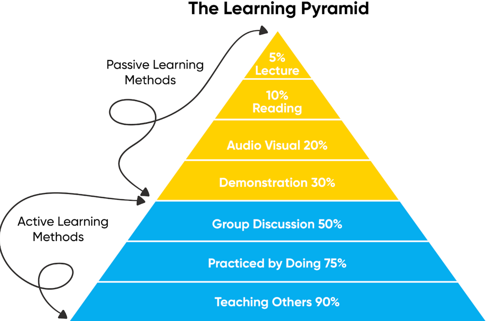
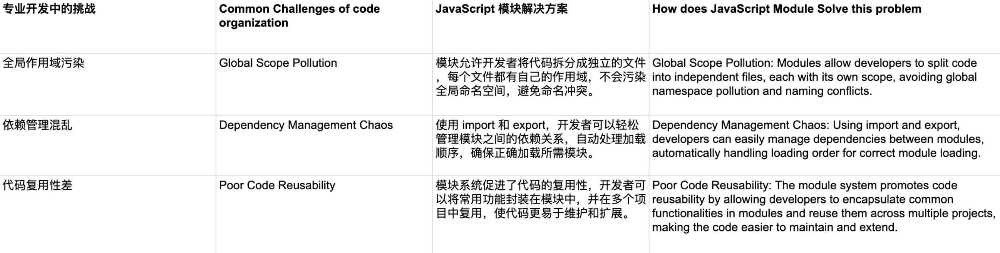

# JavaScript ES6 Part 2

## Description

- 本篇笔记是根据Justin老师 Lecture 08 JavaScript ES6 的课堂内容整理的随堂笔记
- 参考资料：
  - 课程PPT：https://www.canva.com/design/DAGKiRmk2gc/6JWgFJ7F-CkFB5C8IhNOLQ/view?utm_content=DAGKiRmk2gc&utm_campaign=designshare&utm_medium=link&utm_source=viewer#17

## Table of Contents

1. [Callback, Promise, Async/Await](#1-callback-promise-asyncawait)
   - 1.1 [Callback](#11-callback)
   - 1.2 [Promise](#12-promise)
   - 1.3 [Async/Await](#13-asyncawait)
2. [Modules (Import/Export)](#2-modules-importexport)
3. [Classes](#3-classes)
   - 3.1 [JavaScript 类在 React 项目中的使用](#31-javascript-类在-react-项目中的使用)
   - 3.2 [Classes 是什么](#32-classes-是什么)
   - 3.3 [OOP 是什么](#33-oop-是什么)
4. [TypeScript Basics](#4-typescript-basics)




## 1. Callback, Promise, Async/Await

### Callback, Promise, Async/Await 为什么学

1. 从 API 获取数据
使用场景： 在 MOOC 平台中，您可能需要从 API 获取课程数据、用户资料或
课程详情

2. 提交表单并处理响应
使用场景： 当用户提交表单（例如报名参加课程）时，可以使用 async/await
以异步方式处理表单提交。

3. 等待多个 Promise 解析
使用场景： 您可能需要同时获取多个数据，例如获取课程详情和相关课程。

### 1. Callback

回调函数（Callback Function）是指将一个函数作为参数传递给另一
个函数，并在适当的时候由后者调用的函数。


函数作为参数传递： 在 JavaScript 中，函数可以像变量一样传递。你可以将一
个函数传递给另一个函数作为参数，后者在某个时刻执行这个传入的函数。

异步操作： 回调函数常用于异步操作中。例如，当你向服务器请求数据时，这个
操作不会立即完成。在等待服务器响应的过程中，程序不会停止运行。你可以传
递一个回调函数，当数据请求完成时，这个回调函数会被执行。

代码实例：
```js
function processNumber(number, callback) {
    setTimeout(() => {
        const result = number * 2;
        console.log(`Processed number: ${result}`);
        callback(result);
    }, 1000);
}

function processNumbers(numbers) {
    processNumber(numbers[0], (result1) => {
        processNumber(numbers[1], (result2) => {
            processNumber(numbers[2], (result3) => {
                console.log("All numbers processed.")
            })
        })
    })
}

// Test the function
const numbers = [1, 3, 5];
processNumbers(numbers);
```
### 2. Promise

Promise 是一种用于处理异步操作的 JavaScript 对象。
它代表了一个可能在未来完成的操作的结果。

Promise 用于处理异步任务，比如从服务器获取数据或读
取文件。

- Promise：表示一个异步操作的最终完成（或失败）及其结果值。
- then：在 Promise 成功完成后，用于指定要执行的回调函数。
- resolve：用于标记 Promise 已成功完成，并将结果值传递给 then 中的回调函数。
- reject：用于标记 Promise 已失败，并将错误原因传递给 then 或 catch 中的回调函数。
- catch：用于指定在 Promise 失败时要执行的回调函数，处理错误或异常情况。

代码实例：
```js
function processNumber(number) {
    return new Promise((resolve, reject) => {
        setTimeout(() => {
            const result = number * 2;
            console.log(`Processed number: ${result}`);
            resolve(result);
        }, 1000);
    })
}

function  processNumbers(numbers) {
    processNumber(numbers[0])
    .then(result1 => processNumber(numbers[1]))
    .then(result2 => processNumber(numbers[2]))
    .then(result3 => {
        console.log("All numbers processed.");
    })
    .catch(error => {
        console.log("Error processing numbers:", error);
    })
}

// Test the function
const numbers = [1, 2, 3];
processNumbers(numbers);
```

### 3. Async/Await

Async/Await 是基于 Promise 的Syntactic Sugar，使异
步代码看起来像同步代码，便于书写和阅读。

Async/Await 使处理异步操作更简单、更清晰。

代码实例：
```js
function processNumber(number) {
    return new Promise((resolve) => {
        setTimeout(() => {
            const result = number * 2;
            console.log(`Processed number: ${result}`);
            resolve(result);  // Resolve the promise with the result
        }, 1000);
    });
}

async function processNumbers(numbers) {
    try {
        const result1 = await processNumber(numbers[0]);
        const result2 = await processNumber(numbers[1]);
        const result3 = await processNumber(numbers[2]);
        console.log('All numbers processed.');
        return [result1, result2, result3];
    } catch (error) {
        console.error('Error processing numbers:', error);
    }
}

// Test the function
const numbers = [1, 2, 3];
processNumbers(numbers).then(results => {
    console.log('Results:', results);
});
```

## 2. Modules (Import/Export)

模块化允许将代码分成多个文件，每个文件可以导出
（export）和导入（import）功能。

Modules 使代码组织更加清晰，并便于重用和维护。
在 JavaScript 中，rest 参数允许你将不定数量的函数参数表示为一个数组。Rest 参数语法使用三个点号（...）来表示，通常用于**函数声明**中，以便将多余的（剩余的）参数收集到一个数组中。


### 为什么要用Modules？



### 代码实例

CourseCard.js:
```js
import React from 'react';

function CourseCard({ title, description }) {
    return (
        <div className="course-card">
            <h3>{title}</h3>
            <p>{description}</p>
        </div>
    );
}

// 导出 CourseCard 组件
export default CourseCard;
```

CourseList.js:

```js
import React from 'react';
import CourseCard from './CourseCard'; // 导入 CourseCard 组件

function CourseList() {
    const courses = [
        { id: 1, title: 'React 基础', description: '学习 React 的基础知识。' },
        { id: 2, title: '高级 React', description: '深入学习 React 的高级特性。' },
    ];

    return (
        <div className="course-list">
            {courses.map(course => (
                <CourseCard
                    key={course.id}
                    title={course.title}
                    description={course.description}
                />
            ))}
        </div>
    );
}

export default CourseList;
```

## 3. Classes

面向对象编程 (OOP)：
类是面向对象编程的核心概念之一。它允许开发者定义对象的属性（properties）和方法（methods），并通过继承（inheritance）和封装（encapsulation）来重用代码和组织复杂的逻辑。

代码复用和组织：
类使得代码更具结构性，可以通过创建实例（instances）来复用相同的逻辑。继承也允许一个类
从另一个类继承属性和方法，从而减少重复代码。

封装：类可以封装数据和功能，将实现细节隐藏起来，只暴露必要的接口。这有助于保护数据完整性并简
化接口设计。

可读性和维护性：相比于传统的构造函数和原型链，类语法更简洁明了。开发者更容易理解和维护基于类的代码，尤其是在团队合作的项目中。

### 3.1. Classes - JavaScript 类在 React 项目中的使用

 - 定义组件：
在 React 16.8 版本之前，类组件是定义有状态组件（stateful components）的主要方式。通过继承 React.Component，类组件可以维护自己的状态，并在状态改变时重新渲染。

 - 管理状态 (State) 和生命周期方法 (Lifecycle Methods)：
类组件可以使用 this.state 来定义和管理组件的状态。它们还可以实现 React 的生命周期方法（如
componentDidMount、componentDidUpdate 和 componentWillUnmount），以在组件的不同阶段执行特定操作。

 - 处理复杂逻辑：
在处理较复杂的逻辑时，类组件的使用可以使代码更加组织良好。类方法可以封装组件的行为，使得逻辑更易于追踪和测试。

```js
import React, { Component } from 'react';

class CourseList extends Component {
  constructor(props) {
    super(props);
    this.state = {
      courses: [
        { id: 1, title: 'React 基础', description: '学习 React 的基础知识。' },
        { id: 2, title: '高级 React', description: '深入学习 React 的高级特性。' }
      ]
    };
  }

  componentDidMount() {
    // 可以在此处执行数据获取或订阅操作
    console.log('组件已挂载');
  }

  render() {
    return (
      <div className="course-list">
        {this.state.courses.map(course => (
          <div key={course.id} className="course-card">
            <h3>{course.title}</h3>
            <p>{course.description}</p>
          </div>
        ))}
      </div>
    );
  }
}

export default CourseList;
```

### 3.2. Classes - 是什么

Classes 是一种 ES6 提供的语法，用于定义对象的构造函数和继承。

在 React 中，Classes 用于创建具有状态和生命周期方法的组件。


### 3.3. OOP - 是什么

面向对象编程（Object-Oriented Programming，简称 OOP）是一种
编程范式，它将程序设计为由多个对象（Objects）组成，每个对象包
含数据（属性）和操作数据的方法（行为）。OOP 是现代编程中一种
非常流行的编程方法，许多编程语言（包括 JavaScript、Python、
Java 等）都支持面向对象编程。

 - 类（Class）：
类是一个模板或蓝图，用于定义一组具有相同属性和行为的对象。你可以把类看作是创建对象的模板。例
如，Person 类可以定义一个人的基本属性（如名字和年龄）和行为（如说话和走路）。

 - 对象（Object）：
对象是类的实例。类是抽象的，而对象是具体的。使用类创建的每个对象都拥有该类中定义的属性和方法。例如，你可以用 Person 类创建多个对象，每个对象代表一个具体的人。

 - 封装（Encapsulation）：
封装是指将数据（属性）和操作这些数据的方法（行为）打包在一个对象内部，并隐藏对象的内部实现，只暴露必要的接口给外部使用。这有助于保护数据的完整性，并使代码更易于维护。

 - 继承（Inheritance）：
继承是指一个类可以从另一个类继承属性和方法。通过继承，可以创建一个新的类，该类不仅具有自己的属性和方法，还继承了父类的属性和方法。例如，Student 类可以继承 Person 类的所有属性和方法，同时还可以添加自己的属性（如学号）和方法（如学习）。

 - 多态（Polymorphism）：
多态允许子类重写父类的方法，从而以不同的方式实现相同的行为。多态使得不同类型的对象可以通过相同的接口进行操作，增强了代码的灵活性和可扩展性。

Create Person object without using Classes:
```js
function createPerson(name, age) {
  return {
    name: name,
    age: age,
    greet: function() {
      console.log(`Hello, my name is ${this.name} and I am ${this.age} years old.`);
    },
    haveBirthday: function() {
      this.age += 1;
      console.log(`It's my birthday! I am now ${this.age} years old.`);
    }
  };
}

// 创建 Person 对象实例
const person1 = createPerson('Alice', 30);
person1.greet(); // 输出: Hello, my name is Alice and I am 30 years old.
person1.haveBirthday(); // 输出: It's my birthday! I am now 31 years old.
```
Create Person object using Classes:
```js
function createPerson(name, age) {
  return {
    name: name,
    age: age,
    greet: function() {
      console.log(`Hello, my name is ${this.name} and I am ${this.age} years old.`);
    },
    haveBirthday: function() {
      this.age += 1;
      console.log(`It's my birthday! I am now ${this.age} years old.`);
    }
  };
}

// 创建 Person 对象实例
const person1 = createPerson('Alice', 30);
person1.greet(); // 输出: Hello, my name is Alice and I am 30 years old.
person1.haveBirthday(); // 输出: It's my birthday! I am now 31 years old.
```

## 4. TypeScript Basics

为什么要用TypeScript：
 - JavaScript 是一种动态类型语言。
 - 没有类型检查会导致运行时错误。
 - 大型代码库难以调试和维护。
 - 缺乏自动完成和IDE中的类型推断。
 - TypeScript 提供静态类型检查，可以早期捕获错误。

 JavaScript (No type safety):
 ```js
 // 没有类型安全的 JavaScript 代码
function calculateTotal(price, quantity) {
  return price * quantity;
}

let total = calculateTotal(100, "2");
console.log(total); // 输出: "200" (字符串拼接，而不是乘法)
 ```
TypeScript (With type safety):
```js
// 有类型安全的 TypeScript 代码
function calculateTotal(price: number, quantity: number): number {
  return price * quantity;
}

let total: number = calculateTotal(100, 2);
console.log(total); // 输出: 200 (正确的数值乘法)
```