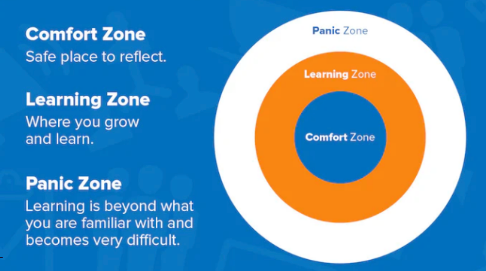
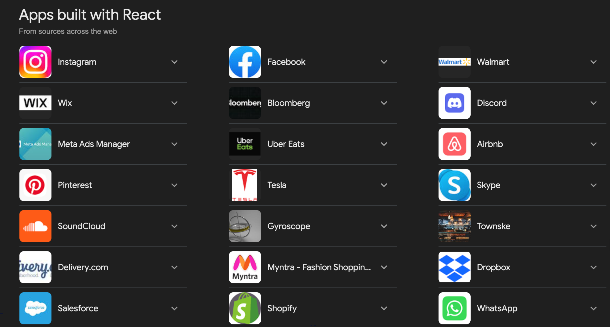
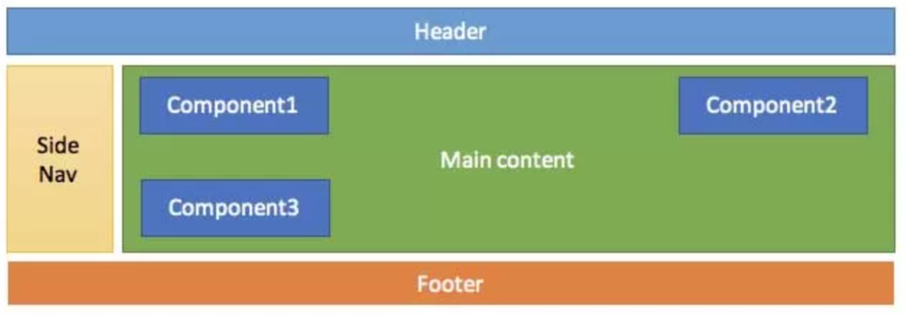
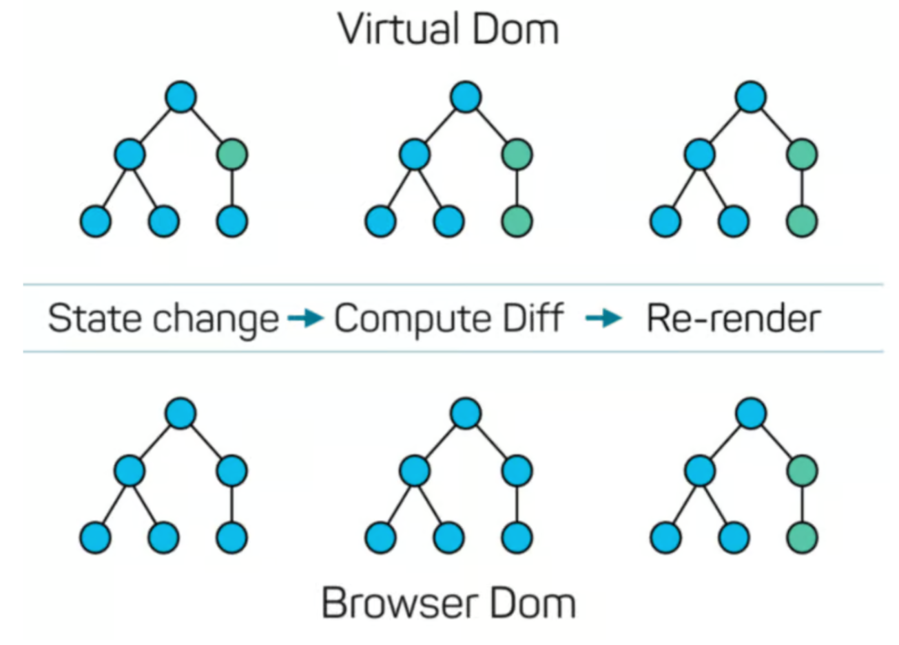
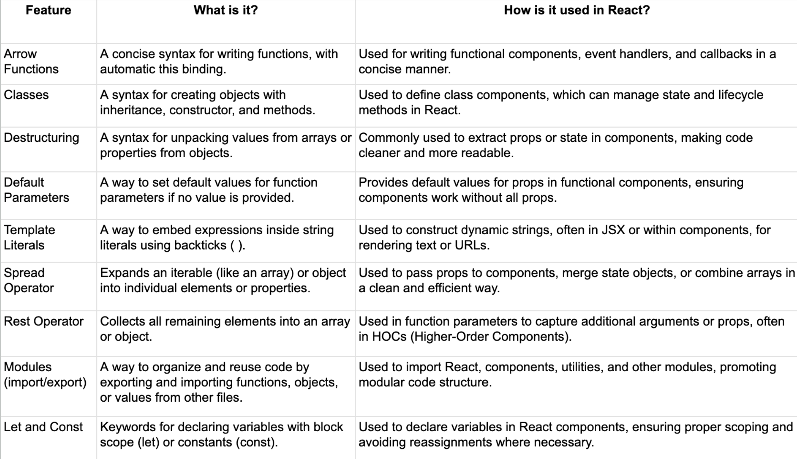
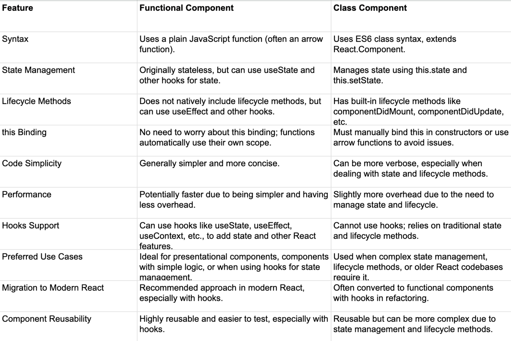

# React Part 1

## Description

- 本篇笔记是根据Justin老师 Lecture 08 React 的课堂内容整理的随堂笔记。
- 参考资料：
  - 课程PPT：https://www.canva.com/design/DAGKifCrxjM/CcTUCK-CmBoFIWjKN3QQ1w/view?utm_content=DAGKifCrxjM&utm_campaign=designshare&utm_medium=link&utm_source=viewer

## Table of Contents

1. [为什么要学习React？](#1-为什么要学习react)
2. [What is React?](#2-what-is-react)
3. [Why use React?](#3-why-use-react)
4. [How does React work?](#4-how-does-react-work)
   - 4.1 [Component tree logic structure - Code organization](#41-component-tree-logic-structure---code-organization)
   - 4.2 [Hypothetical html structure after rendering](#42-hypothetical-html-structure-after-rendering)
   - 4.3 [How does Virtual DOM work under the hood](#43-how-does-virtual-dom-work-under-the-hood)
5. [Setting up the Environment](#5-setting-up-the-environment)
   - 5.1 [Installing Node.js and npm](#51-installing-nodejs-and-npm)
   - 5.2 [Using Create React App (CRA)](#52-using-create-react-app-cra)
6. [Basic React Component](#6-basic-react-component)
7. [JSX](#7-jsx)
   - 7.1 [What is JSX?](#71-what-is-jsx)
   - 7.2 [What Happens Behind the Scenes?](#72-what-happens-behind-the-scenes)
   - 7.3 [JSX vs. HTML](#73-jsx-vs-html)
8. [ES6 in React - Reference Card](#8-es6-in-react---reference-card)
9. [Functional/Class Component](#9-functionalclass-component)
   - 9.1 [What is a Functional Component?](#91-what-is-a-functional-component)
   - 9.2 [What is a Class Component?](#92-what-is-a-class-component)
   - 9.3 [Functional Component vs Class Component](#93-functional-component-vs-class-component)


Learning Zone


## 1. 为什么要学习React？

Internationally Well-known apps built by react


## 2. What is React?

 - 用于构建用户界面的库:
    - React 是由 Facebook 开发的一个 JavaScript
库。
    - 它用于构建动态、交互式的网页应用用户界面
(UI)。
    - 专注于模型-视图-控制器 (MVC) 架构中的“视
图”层。

## 3. Why use React?

 - 可重用性: 构建可重用的组件。
 - 性能: 使用虚拟 DOM 优化渲染。
 - 生态系统: 拥有庞大的工具、库和支持生态系统。

Breakdown by UI


## 4. How does React work?

### 4.1. Component tree logic structure - Code organization
```
/src
│
├── /components
│   ├── /Header
│   │   ├── Header.js
│   │   ├── Header.css
│   │   └── Header.test.js
│   ├── /SideNav
│   │   ├── SideNav.js
│   │   ├── SideNav.css
│   │   └── SideNav.test.js
│   ├── /MainComponent
│   │   ├── MainComponent.js
│   │   ├── MainComponent.css
│   │   └── MainComponent.test.js
│   └── /Component1
│       ├── Component1.js
│       ├── Component1.css
│       └── Component1.test.js
├── /Component2
│   ├── Component2.js
│   ├── Component2.css
│   └── Component2.test.js
├── /Component3
│   ├── Component3.js
│   ├── Component3.css
│   └── Component3.test.js
├── /Footer
│   ├── Footer.js
│   ├── Footer.css
│   └── Footer.test.js
├── App.js
├── App.css
├── index.js
├── index.css
├── reportWebVitals.js
└── setupTests.js
```

### 4.2. Hypothetical html structure after rendering
```html
<!DOCTYPE html>
<html lang="en">
<head>
    <meta charset="UTF-8">
    <meta name="viewport" content="width=device-width, initial-scale=1.0">
    <title>React Project Structure</title>
    <link rel="stylesheet" href="App.css">
</head>
<body>
    <div id="app">
        <header class="header">
            <!-- Header component -->
            <h1>Header</h1>
        </header>

        <nav class="side-nav">
            <!-- Side Navigation component -->
            <ul>
                <li>Link 1</li>
                <li>Link 2</li>
                <li>Link 3</li>
            </ul>
        </nav>

        <main class="main-component">
            <!-- Main Component -->
            <section class="component1">
                <!-- Component 1 -->
                <h2>Component 1</h2>
                <p>Content for Component 1.</p>
            </section>

            <section class="component2">
                <!-- Component 2 -->
                <h2>Component 2</h2>
                <p>Content for Component 2.</p>
            </section>

            <section class="component3">
                <!-- Component 3 -->
                <h2>Component 3</h2>
                <p>Content for Component 3.</p>
            </section>
        </main>

        <footer class="footer">
            <!-- Footer component -->
            <p>Footer content</p>
        </footer>
    </div>

    <script src="index.js"></script>
</body>
</html>
```

### 4.3. How does Virtual DOM work under the hood


## 5. Setting up the Environment

### Installing Node.js and npm

#### Installing Node.js
- Go to the official Node.js website: [https://nodejs.org](https://nodejs.org)
- Choose the LTS (Long Term Support) version for stability.
- Download and run the installer for your operating system (Windows, macOS, or Linux).
- Follow the installation steps (usually just clicking "Next").

#### Verifying the Installation
- Open your terminal (Command Prompt, PowerShell, or Terminal on macOS/Linux).
- Check Node.js version:
  - **Command**: `node -v`
  - **Expected output**: Displays the version number, e.g., `v18.0.0`
- Check npm version:
  - **Command**: `npm -v`
  - **Expected output**: Displays the version number, e.g., `8.0.0`

#### Using Create React App (CRA) to create a new React project
`npx` command allows you to run Node.js commands directly without needing to install the package globally on your system.
```
npx create-react-app my-first-react-app
```
#### Navigate to your project root directory 
```
cd my-first-react-app
```
#### Run your project locally
```
npm start
```
You should be able to load the website in your browser.

## 6. Basic React Component

Create Your First React Component

#### 1. Create a new file, name it `Greeting.js` in the project `/src` folder

#### 2. Write the React component as suggested in this example:

```js
// Greeting.js

import React from 'react';

// This is a functional component that displays a greeting message
function Greeting() {
  return (
    <div>
      <h2>Hello, Welcome to My First React App!</h2>
      <p>This is a simple React component.</p>
    </div>
  );
}

export default Greeting;
```

Import and Use the Component in App.js

#### 1. Open `App.js`

#### 2. Add highlighted lines to the `App.js` file and save the file:

```js
import React from 'react';
import './App.css';
import Greeting from './Greeting'; // Import the Greeting component

function App() {
  return (
    <div className="App">
      <header className="App-header">
        <h1>Main Application</h1>
      </header>
      <Greeting /> {/* Use the Greeting component here */}
    </div>
  );
}

export default App;
```

## 7. JSX
### 7.1. What is JSX ?

JSX is a syntax extension that looks like HTML but is
used within JavaScript.

### 7.2. What Happens Behind the Scenes ?

When this JSX code is processed by React, it gets converted
into regular JavaScript code.

The JSX：
```jsx
const element = <h1>Hello, world!</h1>;
```
Compiles to:
```js
const element = React.createElement('h1', null, 'Hello, world!');
```

### 7.3. JSX vs. HTML
HTML Example:
```html
<!-- Traditional HTML -->
<div class="container">
  <h1>Hello, World!</h1>
  
  <button onclick="alert('Button clicked!')">Click Me</button>
</div>
```
JSX Equivalent:
```jsx
const element = (
  <div className="container">
    <h1>Hello, World!</h1>
    
    <button onClick={() => alert('Button clicked!')}>Click Me</button>
  </div>
);
```
#### Key Differences:
 - class vs className
 - Event Handling
 - Self-closing tags
 - JavaScript Expressions

## 8. ES6 in React - Reference Card


## 9. Functional/Class Component

### What is a Functional Component?

```js
import React from 'react';

// A simple functional component
const Greeting = ({ name }) => {
  return <h1>Hello, {name}!</h1>;
};

export default Greeting;
```
 - A functional component is a simple JavaScript function that returns JSX.
 - It’s the simplest way to create a component in React.

### What is a Class Component?

```js
import React, { Component } from 'react';

// A simple class component
class Welcome extends Component {
  constructor(props) {
    super(props);
    this.state = {
      name: props.name || 'Guest'
    };
  }

  render() {
    return <h1>Welcome, {this.state.name}!</h1>;
  }
}

export default Welcome;
```
 - A class component is a more powerful way to create components in React.
 - It’s a JavaScript class that extends React.Component and must include a render method.
 - Class components can manage their own state and have lifecycle methods.

### Functional Component vs Class Component
