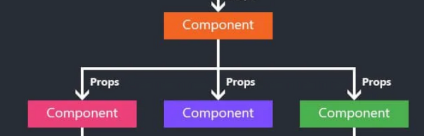
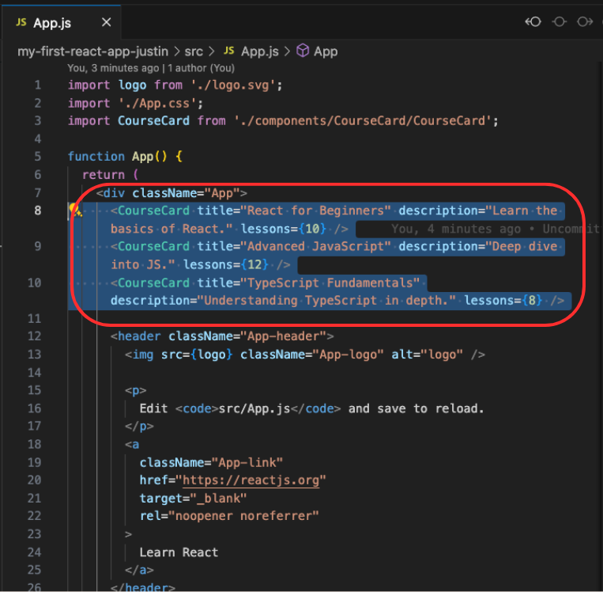
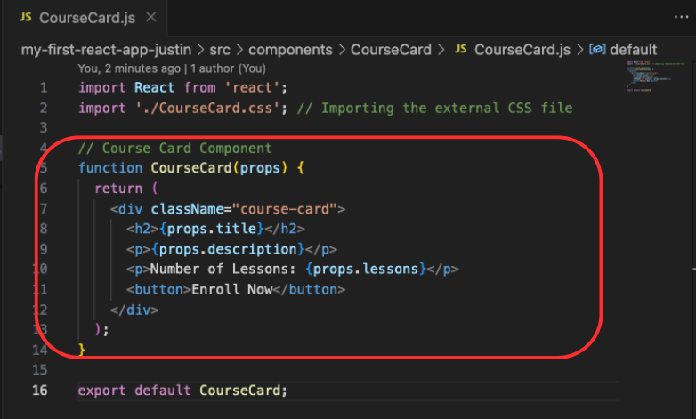
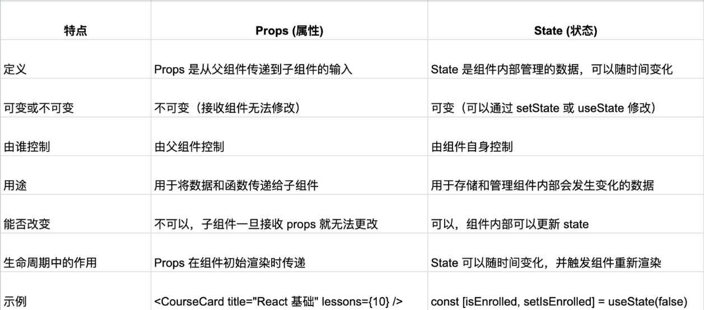

# React Part 2

## Description

- 本篇笔记是根据Justin老师 Lecture 09 React Part2 的课堂内容整理的随堂笔记。
- 参考资料：https://www.canva.com/design/DAGKiaUACaE/idiqI0kjeYpwjTNXg07lSA/view?utm_content=DAGKiaUACaE&utm_campaign=designshare&utm_medium=link&utm_source=viewer

## Table of Contents
- [1. JSX](#1-jsx)
  - [1.1. Embedding Expressions in JSX](#11-embedding-expressions-in-jsx)
  - [1.2. Conditional Rendering](#12-conditional-rendering)
  - [1.3. Styling in JSX Basics](#13-styling-in-jsx-basics)
    - [1.3.1. Introduction to Styling in JSX](#131-introduction-to-styling-in-jsx)
    - [1.3.2. Inline Styling Syntax](#132-inline-styling-syntax)
- [2. Props](#2-props)
  - [2.1. What is Props](#21-what-is-props)
  - [2.2. Why use Props](#22-why-use-props)
  - [2.3. How Props Work](#23-how-props-work)
- [3. State](#3-state)
  - [3.1. What is State?](#31-what-is-state)
  - [3.2. Why use state?](#32-why-use-state)
  - [3.3. How state works](#33-how-state-works)
  - [3.4. What Does useState Do?](#34-what-does-usestate-do)
  - [3.5. What is a Hook?](#35-what-is-a-hook)
  - [3.6. Steps to use state](#36-steps-to-use-state)
  - [3.7. Putting State to Work (MOOC CourseCard)](#37-putting-state-to-work-mooc-coursecard)

## 1. JSX

### What is JSX?

JSX is a syntax extension that looks like HTML but is
used within JavaScript.

```js
const element = <h1>Hello, world!</h1>;

console.log(element);
```
It looks like HTML, but it’s actually JavaScript.

### 1.1. Embeding Expressions in JSX

What are Expressions in JSX?

 - In JSX, you can embed JavaScript expressions inside curly braces { }.
 - Expressions include variables, function calls, conditional logic, and more.


Embedding Variables
```js
const name = "Alice";
function Greeting() {
  return <h1>Hello, {name}!</h1>;
}
```
Embedding Function Calls
```js
function formatName(user) {
  return user.firstName + " " + user.lastName;
}

const user = { firstName: "Alice", lastName: "Johnson" };

function Greeting() {
  return <h1>Hello, {formatName(user)}!</h1>;
}
```
Embedding Math Expressions
```js
const a = 10;
const b = 20;

function MathExample() {
  return <h1>{a} + {b} = {a + b}</h1>;
}
```
Embedding Conditional Logic (with &&)
```js
const isLoggedIn = true;

function Greeting() {
  return (
    <div>
      {isLoggedIn && <h1>Welcome back!</h1>}
    </div>
  );
}
```
Embedding Arrays with .map()
```js
const courses = ["React", "JavaScript", "TypeScript"];

function CourseList() {
  return (
    <ul>
      {courses.map((course) => <li key={course}>{course}</li>)}
    </ul>
  );
}
```
Embedding Objects (JSON)
```js
const course = {
  title: "React for Beginners",
  level: "Beginner"
};

function CourseDetails() {
  return (
    <div>
      <h2>{course.title}</h2>
      <p>Level: {course.level}</p>
    </div>
  );
}
```

### 1.2. Conditional Rendering
什么是条件渲染？

在 React 中，你可以根据某些条件渲染不同的 UI 元素或组件。

你可以使用 JavaScript 操作符，比如 if、else 和三元运算符。
```js
const name = "John";
const isLoggedIn = true;

function Greeting() {
  return (
    <div>
      <h1>Hello, {name}!</h1>
      <p>{isLoggedIn ? "Welcome back!" : "Please sign in."}</p>
    </div>
  );
}
```
三元运算符是编写 JavaScript 中 if-else 语句的简写方式。

简化代码：使代码更加简洁，易于阅读。

内联条件渲染：它允许直接在 JSX 中进行条件渲染，而不会打断代码的流
畅性。

### 1.3. Styling in JSX Basics

#### 1.3.1. Introduction to Styling in JSX
 - In React, you can style components using
inline styles, CSS classes, or external style
sheets.
 - Inline styles are applied directly in the JSX
using a style attribute.

#### 1.3.2. Inline Styling Syntax
 - Inline styles in JSX are written as
JavaScript objects.
 - Properties use camelCase instead of
kebab-case (e.g., backgroundColor
instead of background-color).

Inline Styling Syntax

```js
function StyledComponent() {
  const style = {
    backgroundColor: 'lightblue',
    padding: '10px',
    fontSize: '20px'
  };

  return (
    <div style={style}>
      这是一个带样式的组件!
    </div>
  );
}
```

Dynamic Styling

```js
function DynamicStyledComponent(props) {
  const style = {
    backgroundColor: props.isActive ? 'green' : 'red',
    color: 'white',
    padding: '10px'
  };

  return (
    <div style={style}>
      {props.isActive ? '激活' : '未激活'}
    </div>
  );
}
```

## 2. Props

### 2.1. What is Props
 - Props (short for "properties") are how you pass data from a parent
component to a child component in React.
 - They allow us to make components reusable and dynamic by
customizing them with different data.
### 2.2. Why use Props
 - Components need to be flexible. Instead of hardcoding different values
in each component, we can pass the data as props.
 - This is useful for displaying different courses using the same
component structure.
 - Think of a card template that shows different courses. The card itself
stays the same, but the content changes.
### 2.3. How Props Work
 - Props are passed from parent components to child components.
 - Props are read-only in the child component.
 - A parent component provides the data (like course title or number of
lessons), and the child component renders it.


Code Example



## 3. State

### 3.1. What is State?
 - State is a special object that allows React components to manage data
that changes over time.
 - Unlike props, which are passed from a parent, state is internal to a
component.

Think of state as the "memory" of a component that holds data that can
change during the user interaction.



### 3.2. Why use state?
 - State helps us track and respond to changes, such as user actions (e.g.,
clicking a button).
 - It allows us to update the UI dynamically based on the current data, for
example, changing the text of a button after a user enrolls in a course.
 - Real-life Example: In our MOOC CourseCard, state will store whether a
user has enrolled in a course and dynamically update the button text.

### 3.3. How state works
 - useState Hook: In functional components, we use the useState hook to
declare state.
 - Updating State: The useState hook provides a setter function to update
the state.
 - Reactivity: When state changes, the component re-renders to reflect
the updated data.

### 3.4. What Does useState Do?
 - useState creates a piece of state inside a
functional component.
 - It gives you two things:
    - The current state (the value you want
to track).
    - A function to update that state (when
you want to change the value).

useState Hook Syntax
```js
const [stateVariable, setStateFunction] = useState(initialValue);
```
 - stateVariable：当前状态的值。这是你想要跟
踪的数据。
 - setStateFunction：用于更改状态值的函数。
 - initialValue：组件首次加载时，状态的初始
值。

### 3.5. What is a Hook?
 - Hooks are functions that allow you to use state and other React
features in functional components.
 - useState is one of the most common hooks. It allows you to add state
(data that can change) to your functional components.

### 3.6. Steps to use state
 - Declaring state
 ```js
const [stateVariable, setStateFunction] = useState(initialValue);
```
 - Updating State
 ```js
 function handleEnroll() {
  setIsEnrolled(true);
}
 ```
 - Using State in the UI
 ```js
 <button onClick={handleEnroll}>
  {isEnrolled ? 'Enrolled!' : 'Enroll Now'}
</button>
 ```

### 3.7. Putting State to Work (MOOC CourseCard)
```js
import React, { useState } from 'react';

function CourseCard(props) {
  // Step 1: Use the useState hook to declare the state variable and update function.
  // 'isEnrolled' holds the current state, and 'setIsEnrolled' is used to update it.
  const [isEnrolled, setIsEnrolled] = useState(false);

  // Step 2: Define an event handler function that updates the state when the button is clicked.
  const handleEnroll = () => {
    // Step 3: Call the setter function to update the state.
    setIsEnrolled(true);
  };

  return (
    <div className="course-card">
      <h2>{props.title}</h2>
      <p>{props.description}</p>
      <p>课时数: {props.lessons}</p>

      {/* Step 4: Render the button text conditionally based on the value of 'isEnrolled'. */}
      <button onClick={handleEnroll}>
        {isEnrolled ? '已报名！' : '立即报名'}
      </button>
    </div>
  );
}

export default CourseCard;
```
步骤说明：
 - 声明状态: 我们使用 useState 钩子声明
isEnrolled 和 setIsEnrolled。初始值
isEnrolled 为 false，表示用户尚未报名。
 - 定义事件处理函数: handleEnroll 函数负责
在按钮点击时改变状态。
 - 更新状态: 在 handleEnroll 中，我们调用
setIsEnrolled(true) 来更新状态，这会触发组件的重新渲染。
 - 条件渲染: 我们使用 isEnrolled 状态来更改按钮的文本。如果用户已报名 (isEnrolled
=== true)，按钮显示“已报名！”；否则，显示“立即报名”。
