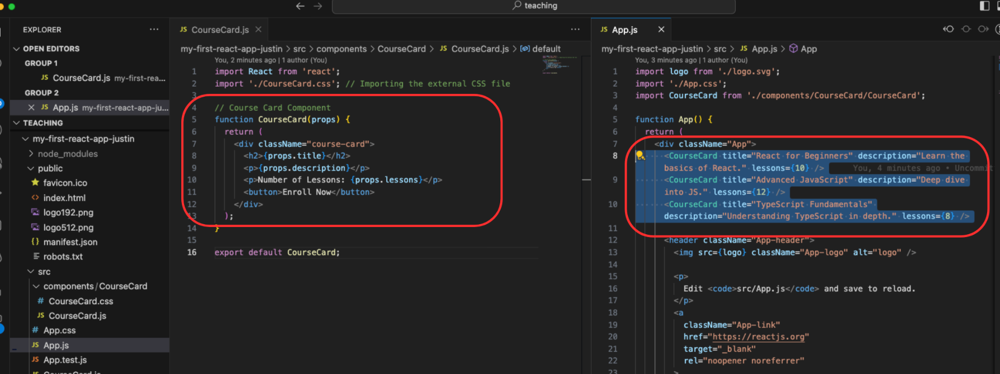

# React Part 3

## Description

- 本篇笔记是根据Justin老师 Lecture 10 React Part3 的课堂内容整理的随堂笔记。
- 参考资料：https://www.canva.com/design/DAGKiej2Vgc/d0fQsjipae-JehedADj_jw/view?utm_content=DAGKiej2Vgc&utm_campaign=designshare&utm_medium=link&utm_source=viewer

## Table of Contents

- [1. TypeScript in React](#1-typescript-in-react)
  - [CourseCard Component in TypeScript](#coursecard-component-in-typescript)
  - [CourseCard Component in JavaScript](#coursecard-component-in-javascript)
  
- [2. Lists and Keys](#2-lists-and-keys)
  - [2.1. Lists](#21-lists)
    - [Why Use Lists](#why-use-lists)
  - [2.2. Keys](#22-keys)
    - [Why Use Keys](#why-use-keys)
  - [2.3. Previously without lists and keys](#23-previously-without-lists-and-keys)
  - [2.4. Implement with lists and keys](#24-implement-with-lists-and-keys)
  
- [3. Event Handling](#3-event-handling)
  - [What Is Event Handling?](#what-is-event-handling)
  - [3.1. Basic Event Handling Syntax](#31-basic-event-handling-syntax)
    - [React Event Handling e.g.](#react-event-handling-eg)
    - [HTML Event Handling e.g.](#html-event-handling-eg)
  - [3.2. Event Handling with Parameters](#32-event-handling-with-parameters)
    - [In JavaScript](#in-javascript)
    - [In TypeScript (TSX)](#in-typescript-tsx)
  
- [4. State lifting](#4-state-lifting)
  - [4.1. What Is State Lifting?](#41-what-is-state-lifting)
  - [4.2. Why Lift State?](#42-why-lift-state)
  - [4.3. State lifting - how to](#43-state-lifting---how-to)


## 1. TypeScript in React

CourseCard Component in TypeScript

```tsx
import React, { useState } from 'react';
import './styles.css';

// Define the type for props
interface CourseCardProps {
  title: string;
  description: string;
  lessons: number;
}

const CourseCard: React.FC<CourseCardProps> = (props) => {
  const [isEnrolled, setIsEnrolled] = useState<boolean>(false);

  const handleEnroll = () => {
    setIsEnrolled(true);
  }

  return (
    <div className="my-class">
      <h2>{props.title}</h2>
      <p>{props.description}</p>
      <p>{props.lessons} lectures</p>

      <button onClick={handleEnroll} disabled={isEnrolled}>
        {isEnrolled ? '已报名' : '立即报名'}
      </button>
    </div>
  );
}

export default CourseCard;
```

CourseCard Component in JavaScript
```js
import React, { useState } from 'react';
import './styles.css';

function CourseCard(props) {
  const [isEnrolled, setIsEnrolled] = useState(false);

  const handleEnroll = () => {
    setIsEnrolled(true);
  }

  return (
    <div className="my-class">
      <h2>{props.title}</h2>
      <p>{props.description}</p>
      <p>{props.lessons} lectures</p>

      <button onClick={handleEnroll} disabled={isEnrolled}>
        {isEnrolled ? '已报名' : '立即报名'}
      </button>
    </div>
  );
}

export default CourseCard;
```

## 2. Lists and Keys

### 2.1. Lists

Lists in React are a way to render multiple
components from an array of data.

```js
const courses = [
  { id: 1, title: "React Basics" },
  { id: 2, title: "Advanced JavaScript" }
];

{courses.map(course => (
  <CourseCard title={course.title} />
))}
```

#### Why Use Lists

- In React, we often deal with arrays of data that
need to be displayed as UI elements (e.g.,
displaying multiple courses).

- Lists allow us to loop through data arrays and
dynamically create components for each item.

### 2.2. Keys

A key is a special string attribute you need to include when creating lists of elements in React.

```js
{courses.map(course => (
  <CourseCard key={course.id} title={course.title} />
))}
```

#### Why Use Keys

- Keys help React identify which items have
changed, been added, or removed.

- They are essential for ensuring that your list re-
renders efficiently when data changes.

### 2.3. Previously without lists and keys



- Problem: This approach is not scalable, as each new course requires manually adding more components, and React cannot efficiently track or update the components.

- Repetitive Code: Each course is hardcoded, which means more manual work as the course list grows.

- No Keys: React has no way to track individual ourses for efficient updates.

### 2.4. Implement with lists and keys


## 3. Event Handling

### What Is Event Handling?

- Event handling allows React to respond to user
actions like clicks, typing, or form submissions.

- Events in React are synthetic events, which
means they are wrapped versions of the native
browser events.

#### Key Concepts: 

- React handles events similarly to DOM events,
but the syntax is different.

- Events are written in camelCase in React (e.g.,
`onClick`, `onChange`).

### 3.1. Basic Event Handling Syntax

#### React Event Handling e.g.

```tsx
<button onClick={handleClick}>Click Me</button>
```

In React, you pass the event handler as a function to the event.

Example: 

- For an onClick event, we provide the handleClick function without parentheses to avoid immediate execution.

Unlike HTML, where events are written as strings (e.g., onclick="doSomething()"), in React, they are passed
as functions (e.g., onClick={doSomething}).

#### HTML Event Handling e.g.

```html
<button onclick="handleClick()">Click Me</button>
```

### 3.2. Event Handling with Parameters

- In React, you pass the event handler as a
function to the event.

Example: 

- For an onClick event, we provide the
handleClick function without parentheses
to avoid immediate execution.

Unlike HTML, where events are written as
strings (e.g., onclick="doSomething()"), in
React, they are passed as functions (e.g.,
onClick={doSomething}).

In JS

```js
function Button({ message }) {
  function handleClick(message) {
    alert(message);
  }

  return (
    <button onClick={() => handleClick(message)}>
      Click Me
    </button>
  );
}
```

In TSX

```tsx
type ButtonProps = {
  message: string;
};

const Button: React.FC<ButtonProps> = ({ message }) => {
  const handleClick = (message: string): void => {
    alert(message);
  };

  return (
    <button onClick={() => handleClick(message)}>
      Click Me
    </button>
  );
};
```

## 4. State lifting

### 4.1. What Is State Lifting?

- Definition: State lifting is a pattern in React where state is moved to a parent component to allow multiple child components to share and access the same state.

- Why It's Important:
    - Helps centralize state management when
multiple components need to interact or
share data.
    - Promotes cleaner, more maintainable code
by avoiding duplication of state across
components.

### 4.2. Why Lift State?

- Scenario: When two or more components need to reflect the same state or affect each other’s state, it becomes inefficient for each component to manage its own state.

- Solution: Lift the state to the nearest common parent component so that the state can be shared between children.

### 4.3. State lifting - how to

```js
function App() {
  // Step 1: Move state here
  const [enrolledCourses, setEnrolledCourses] = useState<number[]>([]);

  // Step 2: Event handler in parent
  const handleEnroll = (courseId: number) => {
    setEnrolledCourses([...enrolledCourses, courseId]);
  }

  return (
    <div className="App">
      {courses.map(course => (
        <CourseCard
          key={course.id}
          title={course.title}
          description={course.description}
          lessons={course.lessons}
          // Step 3: Pass state as props
          isEnrolled={enrolledCourses.includes(course.id)}
          // Step 4: Pass event handler as props
          onEnroll={() => handleEnroll(course.id)}
        />
      ))}
    </div>
  );
}
```
