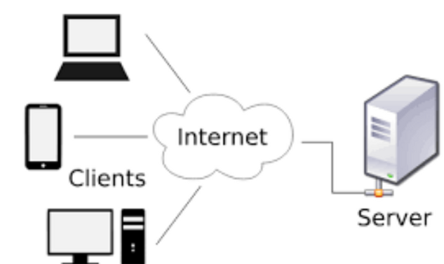
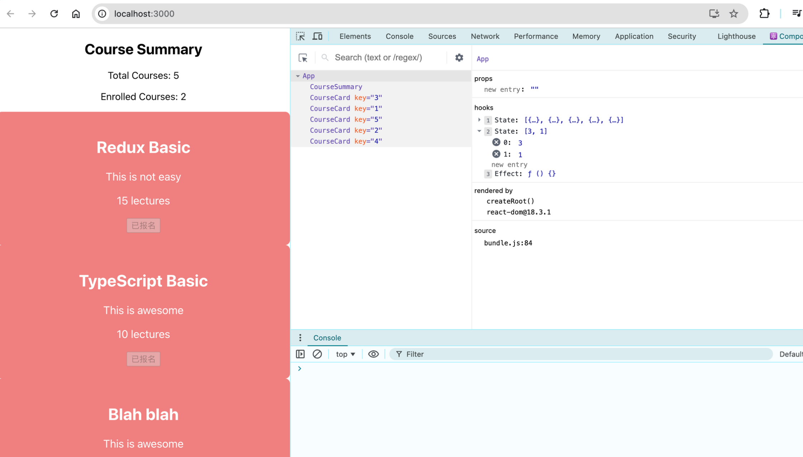

# React Part 4

## Description

- 本篇笔记是根据Justin老师 Lecture 11 React Part4 的课堂内容整理的随堂笔记。
- 参考资料：https://www.canva.com/design/DAGKib-ymUM/fKeAO41kYSYyEudHGNBxbQ/view?utm_content=DAGKib-ymUM&utm_campaign=designshare&utm_medium=link&utm_source=viewer

## Table of Contents

- [1. API calls](#1-api-calls)
  - [1.1. What do we need to use to meet the business requirement](#11-what-do-we-need-to-use-to-meet-the-business-requirement)
  - [1.2. Introduction to API Calls](#12-introduction-to-api-calls)
  - [1.3. How to make API calls?](#13-how-to-make-api-calls)
- [2. API calls in React](#2-api-calls-in-react)
  - [2.1. Knowing about component lifecycle](#21-knowing-about-component-lifecycle)
    - [What is Rendering?](#what-is-rendering)
    - [Initial Render](#initial-render)
    - [Re-Renders](#re-renders)
  - [2.2. Component Lifecycle Overview](#22-component-lifecycle-overview)
    - [Introduce the component lifecycle](#introduce-the-component-lifecycle)
    - [Key Lifecycle Stages](#key-lifecycle-stages)
  - [2.3. How React Renders Components](#23-how-react-renders-components)
    - [Re-Rendering Process](#re-rendering-process)
  - [2.4. Interactive Debugging with React Developer Tools](#24-interactive-debugging-with-react-developer-tools)
  - [2.5. useEffect Hook](#25-useeffect-hook)
    - [The Concept of Side Effects](#the-concept-of-side-effects)
    - [Why Not in the Component Body?](#why-not-in-the-component-body)
    - [useEffect as a Solution](#useeffect-as-a-solution)
    - [Arguments](#arguments)
    - [When Does useEffect Run?](#when-does-useeffect-run)
    - [Benefits of useEffect](#benefits-of-useeffect)

## 1. API calls

### 1.1. What do we need to use to meet the business requirement

```js
// 1. API URL and server basics
const API_URL = 'https://my-json-server.typicode.com/JustinHu8/courseCardMock/courseCards';

// 2. useEffect Hook
useEffect(() => {
    // 3. Fetch
    fetch(`${API_URL}`)
        .then(response => response.json())
        // 4. Promise and Async/Await
        .then(data => {
            setCourses(data);
        })
        .catch(error => console.error('Error fetching courses:', error));
}, []);
```

### 1.2. Introduction to API Calls

Define API: "Application Programming Interface."

APIs allow different software systems to communicate
with each other.

 APIs are like waiters in a restaurant who take your order (request) to the kitchen (server) and bring backyour food (response).

 

- Client: The client is the device (e.g., a web browser or app) that sends a request to the server for information or a service.
- Server: The server is the machine or system that processes requests from clients and sends back the required information or service.
- Request: A request is a message sent by the client to the server, asking for data or some action to be performed.
- Response: A response is the message sent by the server back to the client, providing the requested data or result of the performed action.

### 1.3. How to make API calls? 

### Fetch vs axios:

### Writing in Promise style

- Fetch + Promise
```js
fetch('https://api.example.com/courses')
  .then(response => {
    if (!response.ok) {
      throw new Error('Network response was not ok');
    }
    return response.json();
  })
  .then(data => console.log(data))
  .catch(error => console.error('Error fetching data:', error));
```

- Axios + Promise:
```js
axios.get('https://api.example.com/courses')
  .then(response => {
    console.log(response.data);
  })
  .catch(error => {
    console.error('Error fetching data:', error);
  });
```

### Writing in Async/Await style

- Fetch + Async/Await
```js
async function fetchCourses() {
  try {
    const response = await fetch('https://api.example.com/courses');
    if (!response.ok) {
      throw new Error('Network response was not ok');
    }
    const data = await response.json();
    console.log(data);
  } catch (error) {
    console.error('Error fetching data:', error);
  }
}

fetchCourses();
```

- Axios + Async/Await：
```js
async function fetchCourses() {
  try {
    const response = await axios.get('https://api.example.com/courses');
    console.log(response.data);
  } catch (error) {
    console.error('Error fetching data:', error);
  }
}

fetchCourses();
```

Error Handling with async/await

Without Error Handling:
```js
async function fetchCourses() {
  const response = await fetch('https://api.example.com/courses');
  const data = await response.json();
  console.log(data);
}
```

With Error Handling:
```js
async function fetchCourses() {
  try {
    const response = await fetch('https://api.example.com/courses');
    const data = await response.json();
    console.log(data);
  } catch (error) {
    console.error('Error fetching courses:', error);
  }
}
```
## 2. API calls in React

### 2.1. Knowing about component lifecycle

#### What is Rendering?

- Explain that rendering is the process by which React takes the component and transforms it into DOM elements that the browser can display.

- Every time a React component is rendered, it updates what the user sees on the screen.

#### Initial Render:

When a component is mounted (i.e., added to the DOM), React renders it for the first time. This is called the initial render.

#### Re-Renders:

A re-render occurs when a component's state or props change. React automatically triggers a re-render to ensure the UI stays in sync with the latest data.

### 2.2. Component Lifecycle Overview

#### Introduce the component lifecycle:

- Every React component goes through stages: mounting, updating, and unmounting.

- Briefly touch on these stages to provide context.

#### Key Lifecycle Stages:

- Mounting: When the component is added to the DOM.

- Updating: When state or props change, the component re-renders.

- Unmounting: When the component is removed from the DOM.

- Mounting = Actor steps onto the stage (component appears in the DOM).

- Updating = Actor changes their performance (component updates due to new props or state).

- Unmounting = Actor exits the stage (component is removed from the DOM).

### 2.3. How React Renders Components

State and Props Trigger Re-Renders:

Changes in a component’s state or props are what trigger re- renders. When either of these changes, React efficiently updates the UI to reflect the new data.

#### Re-Rendering Process

- State Change Triggers a Re-Render:
    - Whenever a component's state changes (via setState or useState), React re-renders the component to reflect those changes.
    - Example: Show a button click that updates a counter. Each click triggers a state change,causing a re-render.

```js
const [count, setCount] = useState(0);

return (
  <div>
    <p>You clicked {count} times</p>
    <button onClick={() => setCount(count + 1)}>
      Click me
    </button>
  </div>
);
```

### 2.4. Interactive Debugging with React Developer Tools

Use Dev Tools:

- Use React Developer Tools to inspect which components are rendering and re-rendering in real-time.

- View the component tree and highlight re-renders in the "Highlight Updates" option.

 

### 2.5. useEffect Hook

#### The Concept of Side Effects

In React, a side effect refers to anything that affects something outside of the component, like:

- Fetching data from an API.

- Setting timers (setTimeout, setInterval).

- Manually modifying the DOM.

Why It's Important:

These operations need to happen after the component renders and should not be tied to the rendering process itself.

#### Why Not in the Component Body?

Without useEffect, placing an API call directly in the component’s body might look like this:
```js
const courses = fetch('https://api.example.com/courses');
```
Issue: The component will attempt to call this API every time it re-renders, even if it’s unnecessary.

Performance Impact: This will cause redundant API calls and performance bottlenecks.

### useEffect as a Solution

What useEffect Does: The useEffect hook allows you to run code after the component has rendered, which is exactly when you want to make API calls. This is why it’s called a "side effect" handler.

How It Works: With useEffect, you control when an API call happens:

- On the first render (component mount).

- Or when specific values (like state or props) change.

Example: Compare how using useEffect ensures that the API call is made once when the component is mounted:

```js
useEffect(() => {
  fetch('https://api.example.com/courses')
    .then(response => response.json())
    .then(data => setCourses(data));
}, []);
```

#### Arguments:

- A function where you place your side effect.

- A dependency array that controls when the effect runs (e.g., only once when the component mounts, or whenever specific data changes).

#### When Does useEffect Run?

- It runs after the initial render by default.

- You can control whether it runs again by specifying dependencies (e.g., state, props) in the second argument.

### Benefits of useEffect

- Optimized Side Effects: 

    With useEffect, you can make sure your side effects only run when necessary (e.g., on mount or when certain data changes).

- Clear Separation of Logic: 

    Rendering is separated from side effects, leading to cleaner and more predictable code.

- Controlled Re-Renders:

    useEffect gives you control over when your side effects run, minimizing unnecessary updates.