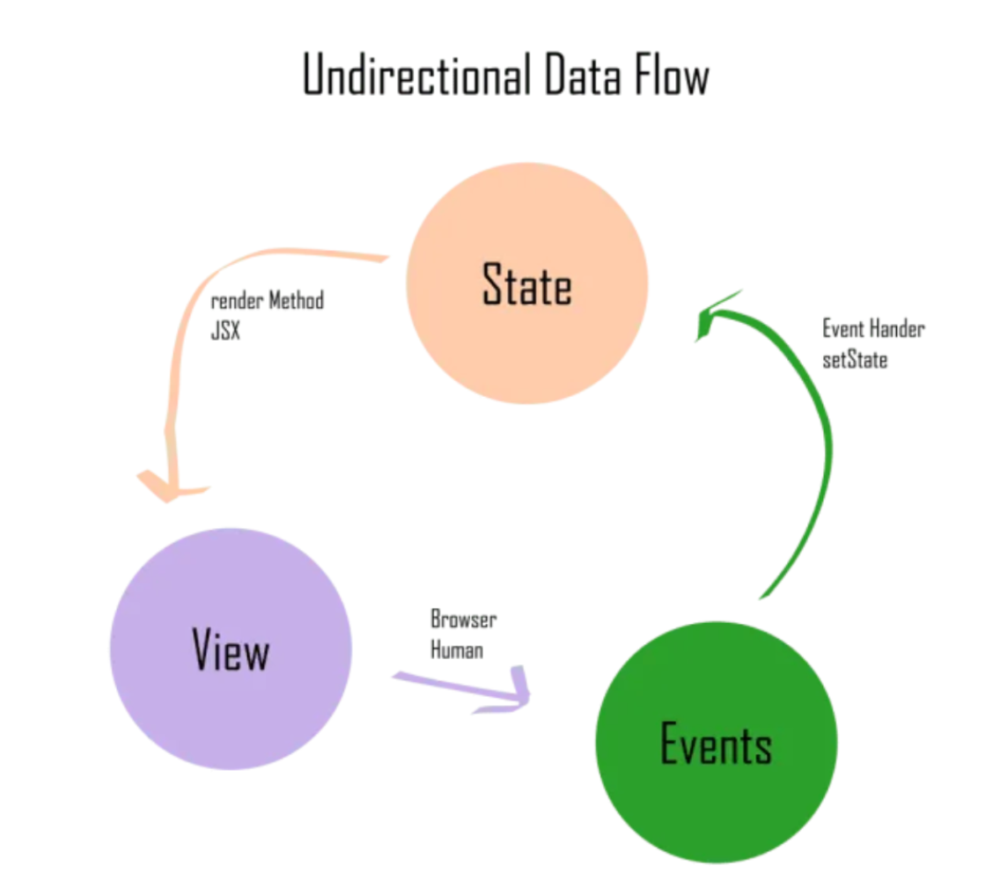

# React Part 5

## Description

- 本篇笔记是根据Justin老师 Lecture 12 React Part5 的课堂内容整理的随堂笔记。
- 参考资料：https://www.canva.com/design/DAGKiq-hNL8/YFq0NLEVMy3sy5ITk_8A9A/view?utm_content=DAGKiq-hNL8&utm_campaign=designshare&utm_medium=link&utm_source=viewer

## Table of Contents

## 1. Thinking in React

### What is Thinking in React?

- React encourages breaking down UI into reusable components.

- Focus on unidirectional data flow and declarative coding style.

- Practical approach: building UI step-by-step.

- Key concepts: State, Props, and Component Hierarchy.

### 1.1. Declarative vs Imperative

Declarative

在声明式编程中，你就像一个乘客，只需要在GPS中输入目的地。你声明你想要去的地方，然后GPS处理路线，绕过交通，提供逐步的导航指示。你不需要担心具体的路线，系统会为你找出路径。同样，在React的声明式风格中，你专注于UI应该是什么样子，React会处理如何据状态变化来更新视图。

```js
import React, { useState } from 'react';

function LikeButton() {
  const [liked, setLiked] = useState(false);

  return (
    <button onClick={() => setLiked(!liked)}>
      {liked ? 'Unlike' : 'Like'}
    </button>
  );
}

export default LikeButton;
```

Imperative

命令式编程风格像手动驾驶,当你在没有GPS的情况下驾驶时，你需要负责旅程中的每一步。你必须知道准确的路线，在正确的地方转弯，根据交通标志调整，并处理任何可能的绕行或挑战。你是在每时每刻告诉汽车该怎么做，就像在命令式编程中，你需要详细指定程序需要执行的每一个小动作。

```js
const button = document.createElement('button');
button.innerText = 'Like';

button.onclick = function() {
  if (button.innerText === 'Like') {
    button.innerText = 'Unlike';
  } else {
    button.innerText = 'Like';
  }
};

document.body.appendChild(button);
```
### 1.2. Unidirectional Data Flow

- Data flows from parent to child components.

- State and props manage data.

- No two-way data binding as seen in other frameworks (like Angular).



### Unidirectional Data Flow vs Two-way Data Flow

#### React - Unidirectional Data Flow

The parent component holds the data (state) and passes it down to child components through props. 

If the child component needs to communicate back, it can trigger an event (like a callback function) that the parent handles, but the flow of data remains in one direction.

#### Angular.js - Two-way Data Flow

Data is bound between the view (UI) and model (data). 

When the model changes, the view updates, and when the view changes (e.g., user input), the model updates as well.

### 1.3. Steps to Thinking in React

- Break UI into a component hierarchy.

- Build a static version of the UI with props.

- Identify minimal state representation.

- Add state and connect it to interactivity.

- Data flow: Ensure state flows from parent to child.

#### Step 1: Breaking Down the UI

#### Step 2: Build a static version of the UI with props

- Take a mock design or existing UI and identify distinct components.

- Example: A shopping cart page.

- Components: Cart, CartItem, CheckoutButton.

#### Step3: Identifying State

Determine the minimal state necessary for your app.

Ask yourself:

- Is it passed via props?

- Does it change over time?

- Can it be computed from other data?

#### Step 4: Adding Interactivity

- Add state to components to handle user interaction (e.g., enrolling in a course).

- Show how user actions trigger state changes.

## 2. Frontend Culture in Australia: Trends & Tools

### 2.1. What Defines Frontend Culture in Australia?

- Australia has a thriving tech industry with a growing focus on web and mobile development.

- Significant emphasis on agility, quality, and collaboration in Australian frontend teams.

- Popular industries: FinTech, eCommerce, and media.

- Australian companies value scalable and user-friendly UI development.

### 2.2. Key Trends in Frontend Development in Australia

- **Responsive & Mobile-first Design**: With high mobile usage, responsive design is critical.

- **Component-Driven Development**: React, Angular, and Vue.js are dominating, emphasizing reusable components.

- **Serverless Architecture**: Adoption of serverless solutions for faster deployments and scalability.

- **Headless CMS**: Decoupling frontend from backend for better flexibility (e.g., using Contentful or Strapi).

- **Progressive Web Apps (PWAs)**: Growing interest in developing apps with near-native performance.

### 2.3. Popular Tools in Australian Frontend Development

- **React.js**: The most popular library for building user interfaces, widely adopted across industries.

- **Webpack & Babel**: Key tools for module bundling and JavaScript compilation.

- **Storybook**: For component-driven development and documentation.

- **Jest & Cypress**: Testing libraries for unit, integration, and end-to-end testing.

- **Figma & Sketch**: Tools for design collaboration, bridging the gap between designers and developers.

- **VSCode**: The go-to IDE for most Australian frontend developers.

### 2.4. Agile Methodology and DevOps in Australian Teams

- **Agile practices dominate**: in Australian tech teams, focusing on iterative development and collaboration.

- **Scrum & Kanban**: Common frameworks for managing projects.

- **DevOps integration**: Frontend teams in Australia often work closely with DevOps to ensure smooth deployment pipelines.

- **Tools**: Jira for project management, CI/CD pipelines using GitLab or GitHub Actions.

### 2.5. Team Collaboration in Australia

- Importance of cross-functional teams (Frontend, Backend, UI/UX, QA).

- Heavy use of Slack and Microsoft Teams for daily communication.

- Emphasis on transparency and open feedback through tools like Trello or Confluence.

- Remote work culture is increasingly common, requiring strong documentation practices.


## 3. Code Quality: Readability & Maintainability

### 3.1. Why Code Quality Matters

- Readable and maintainable code is essential for collaboration, debugging, and scalability.

- Poor-quality code can lead to increased technical debt and hinder long-term development.

- Code is read much more often than it's written, so it should be optimized for readability.

### 3.2. What is Readability

- Clear Naming Conventions: Descriptive and consistent variable, function, and component names.

- Code Structure & Formatting: Use consistent indentation, line spacing, and avoid overly complex structures.

- Comments & Documentation: Comments should explain the why, not the what. Inline documentation is important for external libraries.

- Avoiding Magic Numbers & Strings: Use constants or enums for better clarity.

### 3.3. What is Maintainability

- Maintainable code is easily understandable and can be modified or extended with minimal effort.

- Focus on modularity: Break large codebases into small, self-contained components or modules.

- Write DRY (Don’t Repeat Yourself) code: Avoid duplicating logic or functionality across the codebase.

- Ensure that tests are written alongside code to verify functionality.

### 3.4. Code Review: A Key to Code Quality

- Code review ensures that all team members are aligned on coding standards and quality.

- Peer reviews help catch bugs early, improve code readability, and ensure best practices.

- Focus on constructive feedback and collaboration rather than criticism.

- Tools for code review: GitHub PRs, GitLab Merge Requests, or Bitbucket PRs.

### 3.5. Tools for Enforcing Code Quality

- Linters: Automatically detect code issues and enforce consistent style (ESLint, TSLint).

- Prettier: Automated code formatting to ensure consistency across the project.

- TypeScript: Enforces type safety, making code more readable and maintainable.

- Testing Frameworks: Jest, Mocha, and Cypress for unit and integration testing.
