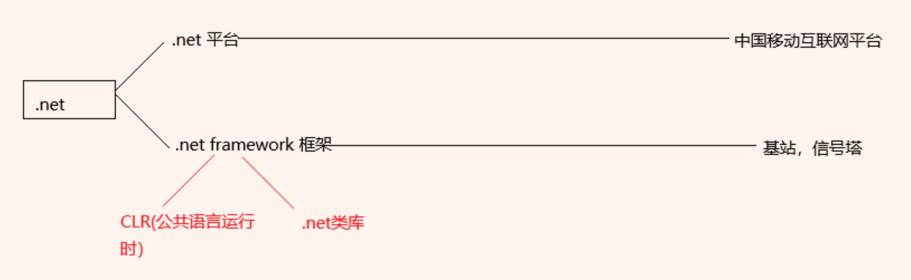
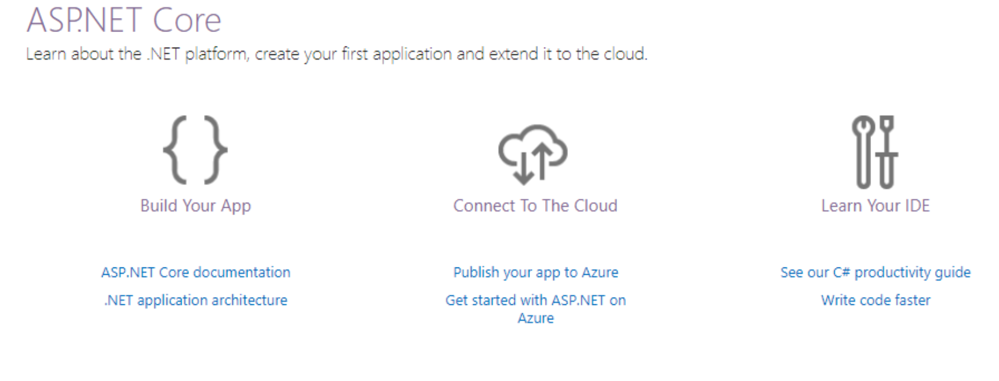
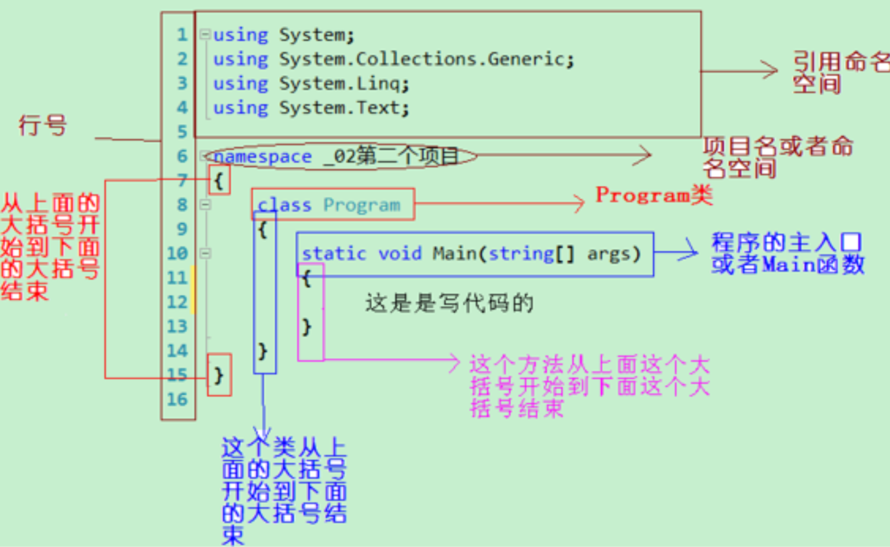
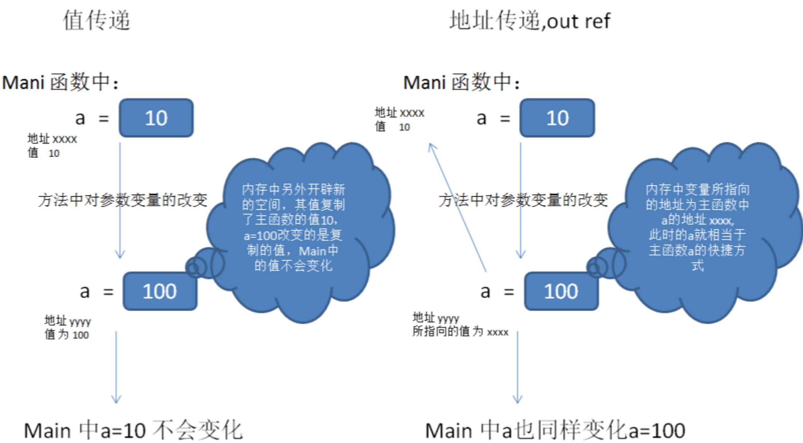

# .NET Part 1

## Description

- 本篇笔记是根据Lily老师 Lecture 13 .NET Part1 的课堂内容整理的随堂笔记。
- 参考资料：https://www.canva.com/design/DAGR7lPNI7g/frOfQSSoV4xqZjjhC8_2AQ/view?utm_content=DAGR7lPNI7g&utm_campaign=designshare&utm_medium=link&utm_source=viewer

## Table of Contents

1. [概念: .NET 与 C#](#概念-net-与-c)
2. [.NET都能干什么](#net都能干什么)
3. [IDE介绍-Visual Studio 和 .NET 在线百科全书](#ide介绍-visual-studio-和-net-在线百科全书)
4. [深入了解 Visual Studio](#深入了解-visual-studio)
5. [VS 中的常用快捷键](#vs-中的常用快捷键)
6. [C#基础](#c基础)
   1. [代码中各个部分的意义](#代码中各个部分的意义)
   2. [有三个常见的 C# 方法](#有三个常见的-c-方法)
   3. [变量和变量的命名](#变量和变量的命名)
   4. [C# 运算符](#c-运算符)
   5. [占位符、转义符、`@` 符号 和 `$` 字符串插值的作用](#占位符转义符-符号-和--字符串插值的作用)
   6. [一元和二元运算符](#一元和二元运算符)
      1. [一元运算符：`++` 和 `--`](#一元运算符-和-)
      2. [二元运算符：`+ - * / %`](#二元运算符--)
      3. [运算符的优先级](#运算符的优先级)
      4. [注意事项](#注意事项)
   7. [关系运算符 & 逻辑运算符 & 复合赋值运算符](#关系运算符--逻辑运算符--复合赋值运算符)
      1. [关系运算符](#关系运算符)
      2. [逻辑运算符](#逻辑运算符)
      3. [复合赋值运算符](#复合赋值运算符)
      4. [关系运算符和逻辑运算符的结合](#关系运算符和逻辑运算符的结合)
   8. [类型转换](#类型转换)
      1. [隐式类型转换](#隐式类型转换)
      2. [显式类型转换](#显式类型转换)
      3. [字符串与数值类型的转换](#字符串与数值类型的转换)
      4. [类型转换的其他方式](#类型转换的其他方式)
   9. [分支结构：if 语句、if-else 语句和三元表达式](#分支结构if-语句if-else-语句和三元表达式)
   10. [选择结构：If else-if & switch-case](#选择结构if-else-if--switch-case)
   11. [Break & Continue](#break--continue)
       1. [`break`](#break)
       2. [`continue`](#continue)
   12. [循环结构](#循环结构)
       1. [`while` 循环](#while-循环)
       2. [`do-while` 循环](#do-while-循环)
       3. [`for` 循环](#for-循环)
       4. [循环嵌套](#循环嵌套)
   13. [程序调试](#程序调试)
   14. [异常捕获](#异常捕获)
   15. [常量和枚举](#常量和枚举)
       1. [常量](#常量)
       2. [枚举（Enum）](#枚举enum)
       3. [枚举类型的转换](#枚举类型的转换)
       4. [使用建议](#使用建议)
   16. [数组](#数组)
   17. [方法（函数）介绍](#方法函数介绍)
   18. [方法语法](#方法语法)
   19. [方法的 out 参数和 ref 参数，可变参数](#方法的-out-参数和-ref-参数可变参数)
   20. [值传递与地址传递（out、ref）](#值传递与地址传递outref)
   21. [方法的返回值与参数：return、out、ref](#方法的返回值与参数returnoutref)


## 1. 概念: .NET 与 C# 

- **.net/dotnet**:.NET是由微软开发的一个平台和技术，旨在支持各种应用程序的开发。

- **C#(sharp)**:一种编程语言，强类型，javascipt弱类型,可以开发基于.net平台的应用.



## 2. .NET都能干什么

- **Web 应用**
  - 使用 .NET 开发动态和交互式的网页应用程序，利用 ASP.NET Core 等框架，可以构建跨平台的高性能网站和API。

- **桌面应用程序**
  - .NET 支持开发 Windows 和 macOS 上的桌面应用程序，常用技术包括 WPF（Windows Presentation Foundation）和 Windows Forms，用于创建功能丰富的用户界面应用。

- **移动应用**
  - 通过 Xamarin 和 .NET MAUI，.NET 可以用来开发跨平台的移动应用程序，一套代码可以部署在 iOS 和 Android 等设备上。

- **云服务**
  - .NET 可以用来构建和部署云端应用，借助 Azure 等云服务平台，开发者可以快速构建可扩展、高可用的分布式应用。

- **Unity3D游戏开发或者虚拟现实**
  - Unity 引擎基于 .NET 技术，开发者可以使用 C# 编写脚本，构建3D游戏、虚拟现实（VR）和增强现实（AR）应用。

- **人工智能（ML.NET）**
  - .NET 提供了 ML.NET 库，用于构建和训练机器学习模型，使开发者能够在 .NET 应用中集成智能预测、分类等人工智能功能。

## 3. IDE介绍-Visual Studio 和 .NET 在线百科全书

**只推荐同学们看微软.net的官方文档去查询，学习！其它都不推荐。**

https://learn.microsoft.com/en-gb/dotnet/csharp/




## 4. 深入了解 Visual Studio

- **Sln**: 解决方案文件，用于管理整个解决方案的项目和配置信息。
  
- **csproj**: 项目文件，包含与项目相关的配置，例如编译选项、依赖项等。

- **cs**: 类文件，编写 C# 代码的文件，通常包含业务逻辑和实现细节。

- **解决方案文件和项目文件以及类文件之间的关系**：  
  一个解决方案（.sln）可以包含多个项目文件（.csproj），每个项目对应一个独立的构建单元。项目文件中引用了不同的类文件（.cs），类文件是实现具体功能的代码。解决方案提供了多个项目的整体结构，项目文件则定义了项目的配置和编译过程，而类文件则是项目中具体的代码实现。

- **认识 VS 的各部分（菜单 / 快捷键 / 工具栏 / 窗口）**：  
  通过菜单栏访问各种开发工具和选项，工具栏提供了常用操作的快捷方式，窗口可以展示不同的信息视图，如“解决方案资源管理器”、“属性”、“错误列表”等。快捷键可以提高工作效率。

### 设置行号
- 通过以下路径设置行号：工具 -> 选项 -> 文本编辑器 -> C# -> 行号。这样可以在编辑代码时看到每一行的编号，便于调试和定位问题。

### 创建多个项目
- 在 Visual Studio 中，你可以在同一个解决方案中添加多个项目。  
  操作步骤：右键点击解决方案资源管理器中的解决方案 -> 添加 -> 新建项目。每个项目可以是独立的应用程序，也可以相互依赖。这样，你可以同时管理多个相关的项目，例如一个 Web 应用和它的 API 项目，或是一个主程序和辅助工具。

### 启动项目设置
- 当解决方案中有多个项目时，通常需要指定一个启动项目。右键点击你想启动的项目，选择“设为启动项目”。也可以在解决方案属性中，设置多个项目的启动顺序，甚至让多个项目同时启动，适用于调试多个相互依赖的项目。

### 项目的加载与卸载
- 你可以选择在解决方案中加载或卸载某个项目。右键点击项目 -> 选择“卸载项目”可以暂时将其从解决方案中移除（但不删除项目文件）。当你需要时，可以右键点击解决方案资源管理器中的解决方案 -> 选择“重新加载项目”。这样可以在项目较多的情况下，减少不必要的加载，提升开发环境的响应速度。

### 运行代码的两种方式
1. **F5 / Ctrl + F5**: 按下 F5 键会启动调试模式，允许你逐步检查代码运行情况。按 Ctrl + F5 则以非调试模式运行项目，更适合在无需调试的情况下测试代码。
2. **点击运行按钮**: 在 Visual Studio 的工具栏中，点击“开始”按钮（绿色的箭头）可以直接运行项目。如果有多个启动项目，Visual Studio 会按照你之前设定的启动项目运行。


## 5. VS 中的常用快捷键

- **Ctrl+K+D**: 快速对齐代码

- **Ctrl+Z**: 撤销

- **Ctrl+S**: 保存（一定要经常保存！）

- **Ctrl+J**: 快速弹出智能提示

- **Shift+End**、**Shift+Home**: 选择到行尾或行首

- **Ctrl+K+C**: 注释所选代码

- **Ctrl+K+U**: 取消对所选代码的注释

- **F1**: 转到帮助文档

- **折叠冗余代码**: 使用 `#Region` 和 `#EndRegion` 包裹代码块

## 6. C#基础

### 6.1. 代码中各个部分的意义




### 6.2. 有三个常见的 C# 方法

- **Console.WriteLine()**  
  这是一个用于向控制台输出文本或变量值的方法。它会将参数内容打印在控制台窗口上，并在输出完成后自动换行。常用于调试和显示程序的执行结果。

- **Console.ReadKey()**  
  此方法用于从用户输入中读取一个按键，并返回用户按下的键值。当代码执行到此处时，程序会暂停，直到用户按下任意键。该方法通常用于在程序结束前等待用户输入，以便查看输出结果。

- **Console.ReadLine()**  
  该方法从控制台读取一行用户输入，直到用户按下 Enter 键为止。它返回输入的字符串，常用于获取用户输入的数据并用于进一步处理，比如将输入的数据赋值给变量。

### 6.3. 变量和变量的命名

我们在计算机中存储数据和客人住旅馆很类似。

命名规则：

- 必须以“字母”_或@符号开头.--不要以数字开头

- 后面可以跟任意“字母”、数字、下划线

注意:

- 你起的变量名不要与C#系统中的关键字重复.

- 在C#中,大小写是敏感的.

- 同一个变量名不允许重复定义

定义变量时，变量名要有意义 

C# 变量命名编码规范——Camel 命名法：

首个单词的首字母小写，其余单词的首字母大写。

Pascal命名命名规范:每一个单词第一字母都大写

如果使用到英文单词的缩写，全部用大写！

**不同的变量占用的内存空间不同：**  

- int: 占用 4 字节（32 位），用于存储从 -2,147,483,648 到 2,147,483,647 之间的整数。

- short: 占用 2 字节（16 位），用于存储从 -32,768 到 32,767 之间的整数。

- long: 占用 8 字节（64 位），用于存储更大的整数范围。

- float: 占用 4 字节，适合存储单精度浮点数。

- double: 占用 8 字节，适合存储双精度浮点数。

- decimal: 占用 16 字节，适合存储高精度的十进制数，常用于金融计算。

#### 变量类型

- **int**: (整数)  
  示例: `1`, `250`, `520`

- **double**: (小数)  
  示例: `3.1415926`, `1.4142135623731`

- **char**: (字符)  
  示例: `'A'`, `'b'`, `'a'`, `'钱'`

- **string/char**: (字符串/字符)  
  示例: `"Lily"`, `"HelloWorld"`, `"a"`

- **decimal**: (金钱小数)  
  用于存储精确的金钱数值  
  示例: `5.62m`

  ```csharp
  decimal d = 5.55m;  // 正确
  decimal d1 = 5;     // 错误

C#：强类型语言 vs JavaScript：弱类型语言


### 6.4. C# 运算符

#### 赋值运算符 `=`

- 示例：`int num = 9; num = num + 1;`  
  这里的 `=` 是**赋值运算符**，它的含义不是数学意义上的“相等”，而是把等号右边的值赋给左边的变量。

- **变量可以重复赋值**：一旦给一个变量赋了新值，变量中的旧值就会被新值替代，不再存在。

#### `+` 号的作用

1. **连接**：当 `+` 号两边有一边是字符串时，`+` 号起到连接的作用。
2. **相加**：当 `+` 号两边都是数字时，`+` 号用于进行数值相加。

#### 算术运算符（`+`, `-`, `*`, `/`, `%`）

- 运算符优先级：先乘除，后加减；如果有括号，则先计算括号里的内容。
- 相同级别的运算符按从左到右的顺序计算。
- 小括号可以无限制嵌套使用，但必须成对出现。


## 6.5. 占位符、转义符、`@` 符号 和 `$` 字符串插值的作用

占位符：

使用方法：先挖一个坑，再填一个坑。

```csharp
int age = 25;
string name = "John";
Console.WriteLine("My name is {0}, and I am {1} years old.", name, age);
// 输出：My name is John, and I am 25 years old.
```

使用占位符时需要注意的地方：

1、挖了几个坑，就需要填几个坑。如果多填了，额外的内容无效果；如果少填了，会抛出异常。

```csharp
Console.WriteLine("I have {0} apples.", 5, 10);
// 多填的 10 将不会显示，输出：I have 5 apples.

Console.WriteLine("I have {0} apples and {1} oranges.", 5);
// 少填会抛出异常，因为缺少第二个占位符的值。
```

2、输出顺序：按照挖坑的顺序进行输出。

```csharp
int a = 5;
int b = 10;
Console.WriteLine("a = {0}, b = {1}", a, b);
// 输出：a = 5, b = 10
```

转义字符：

转义符由 `'\'` 和一个特殊字符组成，用于表示特殊含义的字符。

常见转义字符：

`\n`: 表示换行  
`\"`: 表示一个英文半角双引号  
`\t`: 表示一个 tab 键的空格  
`\b`: 表示一个退格键（在字符串两边无效果）  
`\r\n`: Windows 操作系统识别的换行符  
`\\`: 表示一个 `\` 字符

转义字符的使用示例：

```csharp
Console.WriteLine("Hello\nWorld");
// 输出：
// Hello
// World

Console.WriteLine("He said, \"Hello!\"");
// 输出：He said, "Hello!"

Console.WriteLine("Name\tAge");
// 输出：Name    Age

Console.WriteLine("Hello\\World");
// 输出：Hello\World
```

特殊情况：

```csharp
Console.WriteLine("This is a backspace\bTest");
// 退格符\b将删除前一个字符，输出：This is a backspacTest
```

`@` 符号的作用：

1、取消 `\` 在字符串中的转义作用，使其单纯表示为一个 `'\'` 字符。

```csharp
string path = @"C:\Users\John\Documents\file.txt";
Console.WriteLine(path);
// 输出：C:\Users\John\Documents\file.txt
```

2、将字符串按照编辑的原格式输出，包括换行、缩进等字符格式。

```csharp
string multiLineText = @"
This is a multi-line text.
Line two is here.
    Line three is indented.";
Console.WriteLine(multiLineText);
// 输出：
// This is a multi-line text.
// Line two is here.
//     Line three is indented.
```

`$` 字符串插值的作用：

1、`$` 符号允许直接在字符串中嵌入变量和表达式，使代码更简洁和可读。

```csharp
int age = 25;
string name = "John";
Console.WriteLine($"My name is {name}, and I am {age} years old.");
// 输出：My name is John, and I am 25 years old.
```

2、可以嵌入表达式进行计算或操作。

```csharp
int a = 5;
int b = 10;
Console.WriteLine($"The sum of {a} and {b} is {a + b}.");
// 输出：The sum of 5 and 10 is 15.
```

3、`$` 符号可以与 `@` 符号组合使用，形成逐字字符串的插值。

```csharp
string fileName = "data.txt";
string path = @$"C:\Users\John\Documents\{fileName}";
Console.WriteLine(path);
// 输出：C:\Users\John\Documents\data.txt
```


## 6.6. 一元和二元运算符

### 6.6.1. 一元运算符：`++` 和 `--`

- **`++`（自增运算符）**：将变量的值加 1，可以作为**前置**（`++x`）或**后置**（`x++`）运算符。  
  - **前置自增**（`++x`）：先将变量值加 1，然后将加 1 后的值用于表达式中的计算。  
  - **后置自增**（`x++`）：先使用变量的原始值进行表达式计算，然后再将变量值加 1。

- **`--`（自减运算符）**：将变量的值减 1，可以作为**前置**（`--x`）或**后置**（`x--`）运算符。  
  - **前置自减**（`--x`）：先将变量值减 1，然后将减 1 后的值用于表达式中的计算。  
  - **后置自减**（`x--`）：先使用变量的原始值进行表达式计算，然后再将变量值减 1。

**示例代码：**

```csharp
int x = 5;

x++;  // 后置自增运算，x 先参与运算，后变为 6
x--;  // 后置自减运算，x 先参与运算，后变为 5

int y = ++x;  // 前置自增，x 先变为 6，然后 y 被赋值为 6
int z = --x;  // 前置自减，x 先变为 5，然后 z 被赋值为 5
```

### 6.6.2. 二元运算符：`+ - * / %`

- **加法运算符（`+`）**：用于两个数值相加。
- **减法运算符（`-`）**：用于两个数值相减。
- **乘法运算符（`*`）**：用于两个数值相乘。
- **除法运算符（`/`）**：用于两个数值相除。注意，如果两个整数相除，结果为整数（即忽略小数部分）。如果需要得到小数结果，需要使用浮点数。
- **取余运算符（`%`）**：返回除法运算的余数。常用于检查一个数是否能被另一个数整除。

**示例代码：**

```csharp
int a = 10;
int b = 3;

int sum = a + b;       // 加法运算，sum 是 13
int difference = a - b; // 减法运算，difference 是 7
int product = a * b;    // 乘法运算，product 是 30
int quotient = a / b;   // 整数除法，quotient 是 3
int remainder = a % b;  // 取余运算，remainder 是 1
```

### 6.6.3. 运算符的优先级

- 在表达式中，**一元运算符**的优先级高于**二元运算符**。  
- 运算符的执行顺序是：先进行乘法、除法和取余，再进行加法和减法。  
- 使用**括号**可以改变默认的运算顺序，括号中的表达式将优先计算。

**示例代码：**

```csharp
int z = 10;
int result = ++z * 2;  // 首先执行 ++z，z 变为 11，然后计算 11 * 2，result 是 22

int complexResult = (a + b) * 2;  // 首先计算 a + b (13)，然后 13 * 2，complexResult 是 26
```

### 6.6.4. 注意事项

- **整数除法**：在 C# 中，如果两个整数进行除法运算，结果仍然是整数，忽略小数部分。如果想要保留小数部分，需要使用浮点数类型（如 `float` 或 `double`）。
  
  **示例代码：**
  
  ```csharp
  int x = 5;
  int y = 2;
  int result = x / y;  // 结果是 2，而不是 2.5

  // 使用浮点数可以得到精确结果
  double resultDouble = (double)x / y;  // 结果是 2.5
  ```

- **自增自减运算**：前置和后置的区别在于它们在表达式中的使用方式。如果只对变量进行自增或自减，它们的行为是一样的；但如果它们在复杂表达式中，前置会先改变变量的值，后置会先使用原值。


## 6.7. 关系运算符 & 逻辑运算符 & 复合赋值运算符

### 6.7.1. 关系运算符

关系运算符是用来描述两个事物之间的关系，在 C# 中，使用 **bool 类型**来描述运算结果，它的值可以是 `true` 或 `false`。

- **常见的关系运算符：**
  - `==`：等于
  - `!=`：不等于
  - `>`：大于
  - `<`：小于
  - `>=`：大于等于
  - `<=`：小于等于

**示例代码：**

```csharp
int a = 10;
int b = 20;

bool isEqual = (a == b);   // 判断 a 是否等于 b，结果是 false
bool isNotEqual = (a != b); // 判断 a 是否不等于 b，结果是 true
bool isGreater = (a > b);  // 判断 a 是否大于 b，结果是 false
bool isLessOrEqual = (a <= b);  // 判断 a 是否小于等于 b，结果是 true
```

### 6.7.2. 逻辑运算符

逻辑运算符用于组合或反转布尔值表达式，逻辑表达式的结果同样是 **bool 类型**。逻辑运算符可以将多个条件组合在一起，判断其结果是 `true` 还是 `false`。

- **常见的逻辑运算符：**
  - `&&`：逻辑与（当两个表达式都为 `true` 时，结果为 `true`）
  - `||`：逻辑或（当至少一个表达式为 `true` 时，结果为 `true`）
  - `!`：逻辑非（将 `true` 变为 `false`，将 `false` 变为 `true`）

**示例代码：**

```csharp
bool condition1 = (a > 5);  // true
bool condition2 = (b < 30);  // true

bool resultAnd = condition1 && condition2;  // 逻辑与，结果是 true，因为两个条件都为 true
bool resultOr = condition1 || condition2;   // 逻辑或，结果是 true，因为至少一个条件为 true
bool resultNot = !condition1;  // 逻辑非，结果是 false，因为 condition1 为 true
```

### 6.7.3. 复合赋值运算符

复合赋值运算符是对常见的赋值操作（`=`）与数学运算符的组合，使表达式更加简洁。它们的作用是对变量进行运算后，再将结果赋值回该变量。

- **常见的复合赋值运算符：**
  - `+=`：加法赋值，`number += 20` 相当于 `number = number + 20`
  - `-=`：减法赋值，`number -= 5` 相当于 `number = number - 5`
  - `*=`：乘法赋值，`number *= 5` 相当于 `number = number * 5`
  - `/=`：除法赋值，`number /= 2` 相当于 `number = number / 2`

**示例代码：**

```csharp
int number = 10;

number += 20;  // 相当于 number = number + 20，number 现在是 30
number -= 5;   // 相当于 number = number - 5，number 现在是 25
number *= 5;   // 相当于 number = number * 5，number 现在是 125
number /= 5;   // 相当于 number = number / 5，number 现在是 25
```

### 6.7.4. 关系运算符和逻辑运算符的结合

关系运算符和逻辑运算符可以结合使用，形成更复杂的条件判断表达式。

**示例代码：**

```csharp
int x = 5;
int y = 10;
int z = 15;

bool combinedCondition = (x < y) && (y < z);  // 判断 x 是否小于 y 且 y 是否小于 z，结果为 true
bool anotherCondition = (x == 5) || (z == 20);  // 判断 x 是否等于 5 或 z 是否等于 20，结果为 true
```

| 运算符 | 作用     | 示例      | 结果  |
|--------|----------|-----------|-------|
| ==     | 等于     | 5 == 5    | true  |
| !=     | 不等于   | 5 != 4    | true  |
| >      | 大于     | 5 > 3     | true  |
| <      | 小于     | 3 < 5     | true  |
| >=     | 大于或等于 | 5 >= 5   | true  |
| <=     | 小于或等于 | 4 <= 5   | true  |


## 6.8. 类型转换

### 6.8.1. 隐式类型转换

隐式类型转换是编译器自动完成的，当一个类型的变量可以安全地转换为另一个类型时，不需要显式地进行类型转换。通常，隐式转换发生在不会导致数据丢失的情况下，例如从低精度类型转换为高精度类型。

**隐式转换的规则**：
- 小范围的数据类型可以自动转换为大范围的数据类型。
- 例如，`int` 可以自动转换为 `double`，但反之不行，因为 `double` 的范围比 `int` 大。

```csharp
int a = 100;
double b = a;  // 隐式转换：int -> double
```

**补充：**
- 隐式转换发生时不会产生编译错误。
- 常见隐式转换类型：`int` -> `float`，`int` -> `double`，`float` -> `double` 等。

### 6.8.2. 显式类型转换

显式类型转换，也称为**强制类型转换**，是在编译器无法自动完成类型转换时，开发者必须显式地进行类型转换。这种转换通常会有数据丢失的风险，因此需要开发者确保转换的安全性。

**显式转换的规则**：
- 大范围的数据类型转换为小范围的数据类型时需要显式转换，否则会出现编译错误。
- 例如，`double` 转换为 `int`，必须通过显式转换，因为小数部分会被舍弃。

```csharp
double x = 1234.56;
int y = (int)x;  // 显式转换：double -> int，结果为 1234，舍弃小数部分
```

**补充：**
- 显式转换可能会导致数据丢失。例如，将 `float` 转换为 `int` 会丢失小数部分。
- 尽量避免将精度更高的类型（如 `double` 或 `long`）转换为精度较低的类型（如 `int`），除非你确定没有溢出或精度丢失问题。

### 6.8.3. 字符串与数值类型的转换

字符串通常需要通过**显式转换**为数值类型。常用的方式有 `int.Parse()` 和 `Convert.ToInt32()` 方法。

- `int.Parse()`：用于将一个有效的字符串转换为 `int` 类型，字符串必须是可解析的数字格式。
- `Convert.ToInt32()`：类似于 `Parse()`，但它能够处理 `null` 值并返回 0，而 `Parse()` 则会抛出异常。

```csharp
string str = "123";
int num = int.Parse(str);  // 将字符串转换为整数

string str2 = "456";
int num2 = Convert.ToInt32(str2);  // 另一种方式将字符串转换为整数
```

**补充：**
- 当字符串不能正确解析为数字时，`Parse()` 会抛出 `FormatException` 异常，因此在使用前最好通过 `int.TryParse()` 来进行安全的解析，避免程序中断。

```csharp
string invalidStr = "abc";
int parsedValue;
bool success = int.TryParse(invalidStr, out parsedValue);
if (success)
{
    Console.WriteLine($"解析成功: {parsedValue}");
}
else
{
    Console.WriteLine("解析失败，字符串无法转换为整数。");
}
```

### 6.8.4. 类型转换的其他方式

除了使用 `Parse()` 和 `Convert` 类，还有其他的转换方式：

- **`ToString()`**：将任何类型转换为字符串。
  
```csharp
int num = 123;
string str = num.ToString();  // 将整数转换为字符串
```

- **`as` 关键字**：用于引用类型的转换，当转换失败时不会抛出异常，而是返回 `null`。

```csharp
object obj = "hello";
string str = obj as string;  // 成功转换，str 为 "hello"
```

- **`is` 关键字**：用于检查对象是否可以转换为指定类型，通常用于类型安全检查。

```csharp
object obj = "hello";
if (obj is string)
{
    string str = (string)obj;
    Console.WriteLine(str);  // 输出 "hello"
}
```


## 6.9. 分支结构：if 语句、if-else 语句和三元表达式

### 6.9.1. `if` 语句：

`if` 语句用于根据条件是否成立来决定是否执行某一段代码。如果条件为 `true`，则执行代码块；如果为 `false`，则跳过代码块。

**语法**：
```csharp
if (判断条件)
{
    // 当条件为 true 时执行的代码
}
```

**示例代码**：
```csharp
int number = 10;

if (number > 5)
{
    Console.WriteLine("数字大于 5");
}
// 输出：数字大于 5
```

**注意**：
- `if` 语句只执行当条件为 `true` 的代码块。如果条件为 `false`，该代码块将不会执行。
- 条件可以是任何返回布尔值的表达式（`true` 或 `false`）。

### 6.9.2. `if-else` 语句：

`if-else` 语句用于处理当条件为 `true` 或 `false` 的两种情况。`if` 部分处理条件为 `true` 时的情况，`else` 部分处理条件为 `false` 时的情况。

**语法**：
```csharp
if (判断条件)
{
    // 当条件为 true 时执行的代码
}
else
{
    // 当条件为 false 时执行的代码
}
```

**示例代码**：
```csharp
int number = 3;

if (number > 5)
{
    Console.WriteLine("数字大于 5");
}
else
{
    Console.WriteLine("数字小于或等于 5");
}
// 输出：数字小于或等于 5
```

**注意**：
- `else` 语句是可选的。如果你只关心条件为 `true` 的情况，可以只使用 `if` 语句。
- `else` 语句将处理所有未被 `if` 条件捕获的情况。

### 6.9.3. `if-else if` 语句：

当需要判断多个条件时，可以使用 `if-else if` 结构。`if` 检查第一个条件，`else if` 检查更多的条件，最后的 `else` 处理所有未满足的条件。

**语法**：
```csharp
if (条件1)
{
    // 条件1为 true 时执行
}
else if (条件2)
{
    // 条件2为 true 时执行
}
else
{
    // 条件1和条件2都为 false 时执行
}
```

**示例代码**：
```csharp
int number = 7;

if (number > 10)
{
    Console.WriteLine("数字大于 10");
}
else if (number > 5)
{
    Console.WriteLine("数字大于 5 但小于或等于 10");
}
else
{
    Console.WriteLine("数字小于或等于 5");
}
// 输出：数字大于 5 但小于或等于 10
```

### 6.9.4. 三元表达式

三元表达式是一种简洁的条件判断语法，它通过简短的方式来选择返回值。适合简单的 `if-else` 判断，可以减少代码行数。

**语法**：
```csharp
条件 ? 结果1 : 结果2;
```

- 当条件为 `true` 时返回 `结果1`，当条件为 `false` 时返回 `结果2`。
- 三元表达式只适合用于简单的条件判断，复杂逻辑不建议使用三元表达式，易造成可读性差。

**示例代码**：
```csharp
int number = 10;
string result = number > 5 ? "大于 5" : "小于或等于 5";
Console.WriteLine(result);
// 输出：大于 5
```

**嵌套三元表达式**：
- 如果有多个条件需要判断，可以嵌套三元表达式，但嵌套过多会使代码难以阅读，不建议过度使用。
```csharp
int number = 10;
string result = number > 10 ? "大于 10" : number > 5 ? "大于 5" : "小于或等于 5";
Console.WriteLine(result);
// 输出：大于 5
```

### 6.9.5. 使用建议

- **if-else vs 三元表达式**：如果逻辑简单，只是对条件做出单一判断，三元表达式是更好的选择；但是当逻辑复杂时，使用 `if-else` 结构更清晰。
- **if-else if**：如果你有多个条件需要判断，可以使用 `if-else if` 语句，这样代码更具可读性和扩展性。
- **三元表达式的局限性**：三元表达式在复杂条件下容易造成代码可读性差，因此不建议在复杂逻辑中使用它。


## 6.10. 选择结构：If else-if & switch-case

### 6.10.1. `if else-if` 结构

`if-else if` 结构用于处理多个条件判断，从上到下依次进行判断，一旦某个条件为 `true`，则执行相应的代码块，后续的条件将不再检查。如果没有条件为 `true`，则执行 `else` 部分的代码。

**语法**：
```csharp
if (判断条件)
{
    // 要执行的代码
}
else if (判断条件)
{
    // 要执行的代码
}
else if (判断条件)
{
    // 要执行的代码
}
else
{
    // 要执行的代码
}
```

### 6.10.2. `switch-case` 结构

`switch-case` 结构用于根据一个变量的值来执行不同的代码块。`switch` 表达式的值会被依次与每个 `case` 中的值进行匹配，匹配成功后执行对应的代码块，并通过 `break` 语句跳出 `switch` 结构。如果没有匹配的 `case`，则执行 `default` 代码块（可选）。

**语法**：
```csharp
switch (变量或者表达式的值)
{
    case 值1:
        // 要执行的代码
        break;
    case 值2:
        // 要执行的代码
        break;
    case 值3:
        // 要执行的代码
        break;
    // 其他 case
    default:
        // 当没有匹配时执行的代码
        break;
}
```


## 6.11. Break & Continue

### 6.11.1. `break`

`break` 语句有两个常见的用途：
1. **跳出 `switch-case` 结构**：在 `switch-case` 语句中，`break` 用来终止当前 `case` 的执行，跳出 `switch` 语句。
2. **跳出当前循环**：`break` 可以终止当前的 `for`、`while` 或 `foreach` 循环，跳出循环体。通常与 `if` 判断一起使用，表示当满足某些条件时，就不再继续循环。

**示例代码**：
```csharp
for (int i = 0; i < 10; i++)
{
    if (i == 5)
    {
        break;  // 当 i == 5 时，跳出循环
    }
    Console.WriteLine(i);  // 输出 0 到 4
}
```

### 6.11.2. `continue`

`continue` 语句通常用于循环（如 `for` 循环、`while` 循环或 `foreach` 循环）。它的作用是跳过当前循环中的剩余代码，直接进入下一次循环的迭代。

**示例代码**：
```csharp
for (int i = 0; i < 10; i++)
{
    if (i % 2 == 0)
    {
        continue;  // 跳过当前循环迭代，直接进入下一次循环
    }
    Console.WriteLine(i);  // 输出 1, 3, 5, 7, 9
}
```

### 使用场景：
- **`break`**：在需要提前终止循环或 `switch` 结构时使用。
- **`continue`**：在需要跳过某次循环迭代而继续执行下一次循环时使用。


## 6.12. 循环结构

循环结构：语句在满足条件下循环执行多次。常见的循环结构包括 `while`、`do-while`、`for`、`foreach`。

### 6.12.1. `while` 循环：

`while` 循环用于在给定条件为 `true` 时重复执行一段代码。在每次执行循环体之前，都会首先检查条件。

**语法**：
```csharp
while (循环条件)
{
    // 循环体；
}
```

**示例**：
```csharp
int i = 0;
while (i < 5)
{
    Console.WriteLine(i);
    i++;
}
// 输出：0, 1, 2, 3, 4
```

**无限循环**：
```csharp
while (true)
{
    // 这段代码会一直执行，直到手动退出循环
}
```

### 6.12.2. `do-while` 循环：

`do-while` 循环与 `while` 循环类似，不同的是 `do-while` 循环会**先执行一次循环体**，然后再检查条件是否满足。因此，无论条件是否成立，循环体至少会执行一次。

**语法**：
```csharp
do
{
    // 循环体；
} while (循环条件);
```

**示例**：
```csharp
int i = 0;
do
{
    Console.WriteLine(i);
    i++;
} while (i < 5);
// 输出：0, 1, 2, 3, 4
```

### 6.12.3. `for` 循环：

`for` 循环通常用于需要明确知道执行次数的循环。它由三个部分组成：初始化、循环条件和迭代器。

**语法**：
```csharp
for (表达式1; 表达式2; 表达式3)
{
    // 循环体；
}
```

- **表达式1**：循环开始前执行一次的初始化部分（如 `int i = 0`）。
- **表达式2**：每次循环前都会进行条件判断，若条件为 `true`，则继续执行循环；若为 `false`，则退出循环。
- **表达式3**：每次循环结束后都会执行的迭代操作（如 `i++`）。

**示例**：
```csharp
for (int i = 0; i < 5; i++)
{
    Console.WriteLine(i);
}
// 输出：0, 1, 2, 3, 4
```

### 6.12.4. 循环嵌套：

可以将一个循环放在另一个循环体内，形成嵌套循环。外层循环每执行一次，内层循环会执行完整的一遍。

**语法**：
```csharp
for (int i = 0; i < 1; i++)  // 外层循环，执行 1 遍
{
    // 外层循环执行的操作
    Console.WriteLine("外层循环执行一次");

    for (int j = 0; j < N; j++)  // 内层循环，执行 N 遍
    {
        // 内层循环执行的操作
        Console.WriteLine($"内层循环执行第 {j + 1} 次");
    }
}
```

### 使用建议：

- **`while` 循环**：当你不确定循环执行的次数时可以使用 `while` 循环，它会根据条件决定是否继续执行。
- **`do-while` 循环**：如果希望循环至少执行一次，可以使用 `do-while` 循环，因为它会在检查条件之前执行一次循环体。
- **`for` 循环**：当你明确知道循环次数时，`for` 循环是更简洁的选择，尤其是在需要计数时非常方便。
- **嵌套循环**：嵌套循环可以用于处理多维数据或需要进行多重操作的场景，注意控制循环次数，避免性能问题。


## 6.13. 程序调试

### 程序调试（什么时候使用）：

1. 写完一段程序后，想看一下这段程序的执行过程。
2. 当你写完这段程序后，发现程序并没有按照你想象的样子去执行时。

### 调试方法：

1. **F11 逐语句调试（单步调试）**：
   - 按下 F11 键可以逐行查看代码的执行情况，每次执行一行代码，帮助你了解代码的每一步。

2. **F10 逐过程调试**：
   - 使用 F10 进行逐过程调试，会跳过函数调用的详细执行过程，适合当你不关心函数内部的执行时使用。

3. **断点调试**：
   - 通过在某行代码上设置断点，程序运行到该行时会暂停执行，方便你在特定位置查看程序的状态。可以在 IDE 中通过点击行号区域设置或取消断点。


## 6.14. 异常捕获

我们在程序中经常会出现各种各样的异常，如果想要让你的程序更加健壮，在代码中应当经常性地使用 `try-catch` 来进行异常捕获。

**语法**：
```csharp
try
{
    // 可能会抛出异常的代码
}
catch (ExceptionType ex)
{
    // 处理异常的代码
}
finally
{
    // （可选）无论是否抛出异常，都会执行的代码
}
```

- `try`：包含可能会抛出异常的代码块。
- `catch`：用于捕获并处理异常。可以捕获特定类型的异常（如 `NullReferenceException`），或者捕获所有异常（使用 `Exception`）。
- `finally`：可选部分。无论是否抛出异常，`finally` 中的代码总是会执行，常用于释放资源或进行清理操作。

**示例代码**：
```csharp
try
{
    int[] numbers = { 1, 2, 3 };
    Console.WriteLine(numbers[5]);  // 这里会引发数组越界异常
}
catch (IndexOutOfRangeException ex)
{
    Console.WriteLine("数组索引超出范围：" + ex.Message);
}
finally
{
    Console.WriteLine("无论是否出现异常，都会执行的代码");
}
```

### 变量的作用域

变量的作用域是指你能够使用到这个变量的范围。

- 变量的作用域通常从声明它的那一对括号开始，到那一对括号结束为止。
- 在这个范围内，你可以访问并使用这个变量。超出这个范围后，变量将无法再被访问。

**示例代码**：
```csharp
{
    int a = 10;  // 变量 a 在这个代码块内有效
    Console.WriteLine(a);  // 可以访问 a
}
// Console.WriteLine(a);  // 报错，因为 a 超出了作用域
```


## 6.15. 常量和枚举

### 6.15.1. 常量

在 C# 中，常量使用 `const` 关键字声明，表示变量的值在程序运行期间不会改变。常量通常用于定义那些在程序的整个生命周期内都保持不变的值。

**声明常量的语法**：
```csharp
const 数据类型 常量名 = 值;
```

**示例代码**：
```csharp
const int MaxScore = 100;
const string WelcomeMessage = "欢迎来到程序!";
```

**注意**：
- 常量必须在声明时进行初始化，之后不能再修改。
- 常量的值在编译时被确定，因此常量的类型和值必须是编译器能够计算的。

### 6.15.2. 枚举（Enum）

枚举是一种特殊的数据类型，它用于定义一组命名的整型常量，通常用于表示具有有限集合值的类型，例如一周的天数、状态代码等。

**枚举语法**：
```csharp
[public] enum 枚举名
{
    值1,
    值2,
    值3,
    ...
}
```

**示例代码**：
```csharp
public enum Days
{
    Monday,
    Tuesday,
    Wednesday,
    Thursday,
    Friday,
    Saturday,
    Sunday
}
```

**默认值**：
- 在枚举中，每个值默认对应一个整数，默认从 0 开始递增。你也可以手动指定每个枚举值的对应整数值。

**示例**：
```csharp
public enum Status
{
    Success = 1,
    Failure = -1,
    Pending = 0
}
```

### 6.15.3. 枚举类型的转换

C# 允许枚举类型与 `int` 和 `string` 类型之间进行互相转换。这在处理枚举和用户输入或输出时非常有用。

**枚举与 `int` 之间的转换**：
- 你可以将枚举类型强制转换为对应的整数值，或者将整数值转换为相应的枚举类型。

**示例代码**：
```csharp
Days today = Days.Wednesday;
int dayNumber = (int)today;  // 将枚举转换为 int，结果是 2

int anotherDayNumber = 4;
Days anotherDay = (Days)anotherDayNumber;  // 将 int 转换为枚举，结果是 Thursday
```

**枚举与 `string` 之间的转换**：
- 使用 `ToString()` 方法可以将枚举转换为字符串。
- 你可以使用 `Enum.Parse()` 或 `Enum.TryParse()` 方法将字符串转换为枚举值。

**示例代码**：
```csharp
// 枚举转字符串
Days today = Days.Monday;
string dayName = today.ToString();  // 结果是 "Monday"

// 字符串转枚举
string input = "Friday";
Days chosenDay = (Days)Enum.Parse(typeof(Days), input);  // 结果是 Days.Friday

// 使用 TryParse 避免异常
Days result;
bool success = Enum.TryParse("Saturday", out result);  // 结果是 true，result 为 Days.Saturday
```

### 6.15.4. 使用建议

- **常量**：使用常量来表示那些不会改变的值，例如数学常数、程序中固定不变的参数（如最大分数、应用名称等）。
- **枚举**：当一个变量有有限的、固定的可能值时，使用枚举。例如，状态码、选项菜单、星期几等。
- **枚举的类型转换**：在需要与用户输入或存储数据交互时，可以将枚举与整数或字符串进行转换，确保程序更加灵活易用。


## 6.16. 数组

数组是一种用于存储多个相同类型数据的结构。它可以是单维、二维甚至多维数组。

### 数组的声明与初始化语法：
```csharp
int[] 数组名 = new int[长度];
```

### 数组的示例代码：
```csharp
int[] nums = new int[3];            // 创建一个包含3个元素的int数组
int[] nums = {5, 3, 8};             // 使用初始值创建数组
int[] nums = new int[3]{1, 2, 3};   // 创建数组并同时初始化
int[] nums = new int[]{2, 3, 5};    // 使用 new 关键字与初始值创建数组
```

数组是一种常见的数据结构，允许我们存储多个值并通过索引访问这些值。例如：
```csharp
Console.WriteLine(nums[0]); // 输出数组的第一个元素
```

**拓展**：
- **二维数组**：二维数组用于存储表格形式的数据，声明方式类似于一维数组，但需要指定行和列的大小。
```csharp
int[,] matrix = new int[3, 3];  // 3行3列的二维数组
```

---

## 6.17. 方法（函数）介绍

### 什么是方法？
方法是代码的重用机制。方法可以接受输入（参数）并返回输出（返回值），也可以没有输入或返回值。它帮助我们将代码逻辑模块化，使代码更加简洁且易于维护。

### 示例：
```csharp
string s = Console.ReadLine();          // 有返回值的函数
Console.WriteLine("hello");             // 没有返回值的函数
int i = Convert.ToInt32("22");          // 既有参数又有返回值的函数
```

通过使用方法，我们可以将复杂的逻辑拆解成多个可复用的单元，并根据需要调用它们。

---

## 6.18. 方法语法

### 方法的定义语法：
```csharp
[访问修饰符] [static] 返回值类型 方法名()
{
    方法体;
}
```

### 命名规则：
- **方法名**：以大写字母开头，遵循 Pascal 命名法。
- **参数名、变量名**：以小写字母开头，变量名要具有实际意义。

### 调用方法：
- 对于静态方法，可以直接通过方法名调用。如果在同一个类中，可以使用类名或直接调用方法。
- 使用 `return` 语句立即返回方法的结果或结束方法。

### 示例：
```csharp
public static int Add(int x, int y)
{
    return x + y; // 返回两个数相加的结果
}
```

拓展：
- 方法可以有多个参数和返回类型（如使用 `out` 和 `ref`，详细解释见下文）。

---

## 6.19. 方法的 out 参数和 ref 参数，可变参数

### 6.19.1. `out` 参数：
`out` 参数允许在一个方法中返回多个值，适合返回不同类型的多个值。如果返回的是相同类型的多个值，可以考虑返回一个数组。

**示例**：
```csharp
public static void GetValues(out int x, out int y)
{
    x = 10;
    y = 20;
}
```

### 6.19.2. `ref` 参数：
`ref` 参数允许方法对传入的参数进行修改，并将修改后的值带回方法外。`ref` 参数必须在调用前被初始化。

**示例**：
```csharp
public static void ModifyValue(ref int x)
{
    x += 10;
}
```

### 6.19.3. `params` 可变参数：
`params` 用于允许不确定数量的参数输入，将传入的参数视为数组。

**示例**：
```csharp
public static void PrintNumbers(params int[] numbers)
{
    foreach (int num in numbers)
    {
        Console.WriteLine(num);
    }
}
```

---

## 6.20. 值传递与地址传递（out、ref）

### 值传递：
- 当方法使用**值传递**时，方法内部对参数的修改不会影响外部变量的值，因为传递的是变量的副本。

**示例**：
```csharp
void ChangeValue(int a)
{
    a = 100; // 只在方法内生效，外部变量不受影响
}
```

### 地址传递（out、ref）：
- 使用 `ref` 或 `out` 可以通过**地址传递**，方法中对参数的修改将影响外部变量的值。

**示例**：
```csharp
void ChangeValue(ref int a)
{
    a = 100; // 外部变量也会被修改
}
```


图示解释了值传递与地址传递的区别：
- **值传递**：方法内部的修改只影响方法内的变量副本，不影响主函数变量。
- **地址传递**：方法内部的修改直接影响主函数中的变量值。

---

## 6.21. 方法的返回值与参数：return、out、ref

### `return`、`out`、`ref` 的区别：

| 方法    | 返回值的方式                    | 是否能返回多个值  | 参数的初始化要求                     |
|---------|---------------------------------|------------------|-------------------------------------|
| `return` | 返回一个单一值                   | 否               | 不需要                               |
| `out`    | 通过 `out` 参数返回多个值         | 是               | 参数不需要初始化，但方法内必须赋值     |
| `ref`    | 通过 `ref` 参数修改外部变量并返回多个值 | 是               | 参数必须初始化                       |

拓展：
- **`return`**：适合简单返回一个值的方法。
- **`out`**：适合返回多个不同类型的值，方法内必须对 `out` 参数赋值。
- **`ref`**：适合需要修改并返回外部变量的情况，调用前必须初始化。