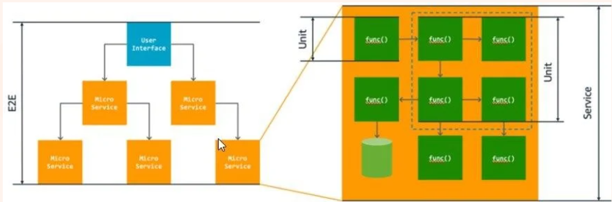

# .NET Part 7

## Description

- 本篇笔记是根据Peng Dai老师 Lecture 19 .NET Part7 的课堂内容整理的随堂笔记。

## Table Of Content

- [1. What is Unit Test](#1-what-is-unit-test)
  - [1.1. Unit Test with Other Testing Types](#11-unit-test-with-other-testing-types)
  - [1.2. Unit Testing – Automated](#12-unit-testing--automated)
- [2. Why Unit Test](#2-why-unit-test)
  - [Advantages / Benefits](#advantages--benefits)
  - [Developers are responsible for writing unit tests](#developers-are-responsible-for-writing-unit-tests)
- [3. Unit Test Strategies – Check for What](#3-unit-test-strategies--check-for-what)
- [4. How to Write the Unit Test](#4-how-to-write-the-unit-test)
  - [Mocking](#mocking)
  - [Most Common Mock Library](#most-common-mock-library)
- [5. TDD – Test Driven Development](#5-tdd--test-driven-development)
  - [TDD Cycle](#tdd-cycle)


## 1. What is Unit Test

Unit Testing is a fundamental aspect of software testing where individual components or functions of a software application are tested in isolation. This method ensures that each unit of the software performs as expected. By focusing on specific parts, unit testing helps verify that each piece works independently.

Unit testing is the process where you test the smallest functional unit of code.

Unit testing is a software development process in which the smallest testable parts of an application, called units, are individually scrutinized for proper operation. Software units could represent functions, methods, or microservices within an application.



### 1.1. Unit Test with Other Testing Types

**Types of Testing (except Unit Test):**

- **Integration Tests** – Testing interactions between different modules or services.
  - E.g., service (Web API / microservice) working with a database.

- **Functional Tests**
  - Focus on business requirements (BA).
  - Verify outputs of production requirements.

- **End-to-End Tests**
  - Replicate end-user behavior.
  - Verify user flows work as expected.
  - Test more complex, real-world scenarios.

- **Acceptance Testing**
  - Ensure the entire application satisfies business requirements.

- **Performance Testing** – Test the system under a particular workload.

- **Smoke Testing** – Basic tests to check that essential and major features are functioning correctly.

### 1.2. Unit Testing – Automated

- **Manual Unit Testing** – No testing tool/framework
  - Not used much
  - Not recommended

- **Automated Unit Testing**
  - Using special tools/testing frameworks
  - Running automatically
  - Part of the required process for building the software
  - Tests are small and focus on specific things at a time

## 2. Why Unit Test

### Advantages / Benefits:
- Early detection of issues (not only bugs but also misunderstandings of the requirements)
- Improved code quality
- Increased confidence
- Faster development
- Reduced time and cost (in the long term)

### Developers are responsible for writing unit tests:
- New feature development
- Any code change/fix/updates in existing projects

## 3. Unit Test Strategies – Check for What

- **Logic Checks:**
  - Verify if the system performs correct calculations and follows the expected path with valid inputs.
  - Ensure all possible paths through the code are tested.

- **Boundary Checks:**
  - Test how the system handles typical, edge case, and invalid inputs.
  - For example, if an integer between 3 and 7 is expected, check how the system reacts to a 5 (normal), a 3 (edge case), and a 9 (invalid input).

- **Error Handling (expected exception thrown):**
  - Check if the system properly handles errors.
  - Does it prompt for a new input, or does it crash when something goes wrong?

- **Object-Oriented Checks:**
  - If the code modifies objects, confirm that the object's state is correctly updated after running the code.

## 4. How to Write the Unit Test

- **Public/protected/private methods**
  - Should we test them all?
  - It could be a bad practice to test private methods directly (using reflection).
  - Recommended: Do not test private methods directly; instead, test the public methods that trigger them.

- **Two types of unit tests**
  - **Fact** – A single test with specific inputs and expected outputs.
  - **Theory** – One test that runs multiple times with different parameters.

- **To write unit test codes for the API project**
  - Create the first unit test project.
  - Write the first unit test.
  - Write the first test theory.

### Mocking

- **What is mock** – To substitute the code dependency
  - Isolate the code (Isolation).
  - Intended behavior given to the substitution (Intention).

- **When to use Mock**
  - When your method takes an **Interface** as an argument.
  - In the unit test, there’s no need for a real implementation of the interface.
  - Essentially, test the method logic using the (output) of the interface instance.

- **What to Mock**
  - Identify dependencies or external components that need to be substituted for testing purposes.

### Most Common Mock Library

- **For .NET - Moq**
  - **Mocking objects** – Set up the objects (e.g., `mockService`)
    ```csharp
    _categoryServiceMock = new Mock<ICategoryService>();
    ```

  - **Mocking service public methods**
    ```csharp
    _categoryServiceMock.Setup(s => s.GetCategoryName(1)).Returns("Games");
    ```

  - **Mocking service protected methods** – Not commonly used
    ```csharp
    using Moq.Protected;

    mockCustomerNameFormatter.Protected()
        .Setup<string>("ProtectedFunction", ItExpr.IsAny<string>())
        .Returns("here can be any value")
        .Verifiable();
    ```
## 5. TDD – Test Driven Development

- **Writing tests before writing the actual code**
- First, write a test and it fails; then, write the code to pass the test.
- Ensures that code is always tested and functional.

### TDD Cycle:
1. **Red** – Write a test that fails.
2. **Green** – Write the minimum code required to pass the test.
3. **Refactor** – Refactor the code to improve it without breaking the test.

> **When to write the Unit Test?** (Before or after?)
