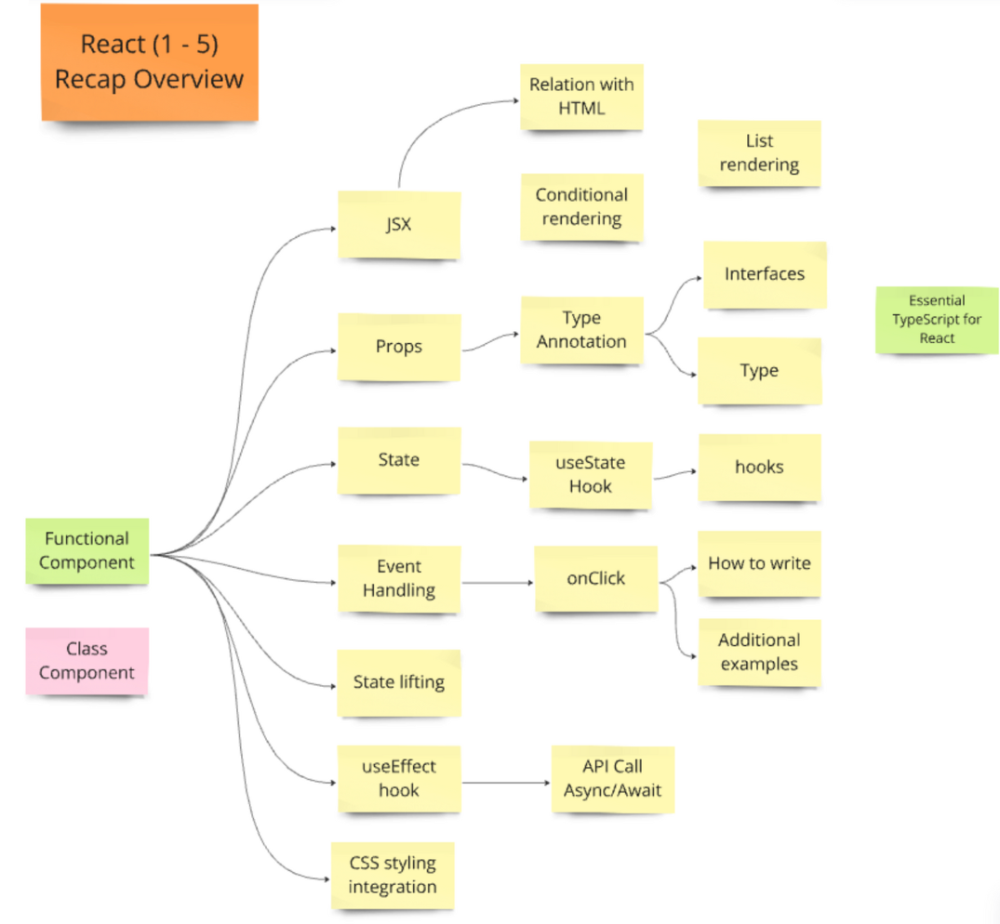
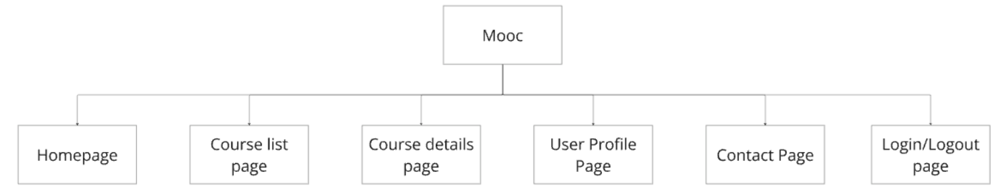
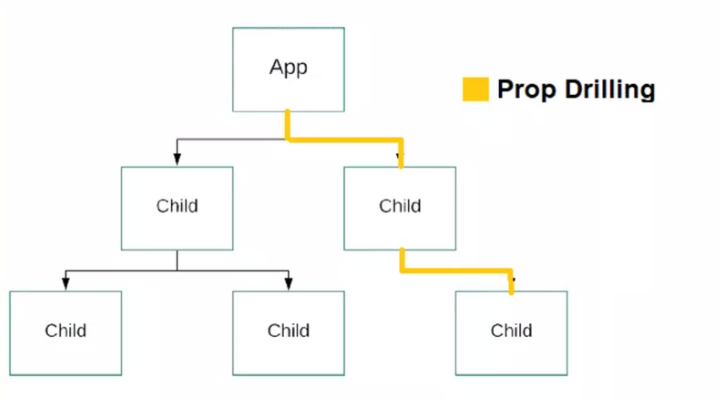
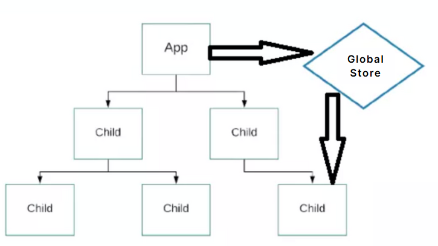

# React Part 6

## Description

- 本篇笔记是根据Justin老师 Lecture 20 React Part6 的课堂内容整理的随堂笔记。
- 参考资料：https://www.canva.com/design/DAGKuRpYe0Y/0JDRf3VyqOF5XVxgCrTcbw/view?utm_content=DAGKuRpYe0Y&utm_campaign=designshare&utm_medium=embeds&utm_source=link

## Table of Contents

- [1. React 1 to 5 Recap](#1-react-1-to-5-recap)
  - [Study Resource](#study-resource)
- [2. Learning Objectives](#2-learning-objectives)
- [3. Feature Requirement](#3-feature-requirement)
- [4. Single-page Application & Routing](#4-single-page-application--routing)
  - [Router](#router)
    - [What is React Router?](#what-is-react-router)
    - [Why do we need it?](#why-do-we-need-it)
- [5. (Global) State Management](#5-global-state-management)
  - [Why Context API or Redux?](#why-context-api-or-redux)
- [6. React Context](#6-react-context)
  - [Context for Global State Management](#context-for-global-state-management)
- [7. Redux](#7-redux)
  - [Introduction to Redux](#introduction-to-redux)
  - [Redux Workflow](#redux-workflow)
  - [Integrating Redux with React](#integrating-redux-with-react)
- [8. React Context vs Redux](#8-react-context-vs-redux)
  - [Context vs Redux: Which One to Use?](#context-vs-redux-which-one-to-use)

## 1. React 1 to 5 Recap

### Study Resource

JS Repo:
https://github.com/JustinHu8/React-1-to-5-recap-javascript
Branch: react-1-to-5-concepts-recap

TS Repo:
https://github.com/JustinHu8/React-1-to-5-recap-typescript
Branch: react-1-to-5-concepts-recap

## 2. Learning Objectives

- Understand the basics of Single Page Application (SPA) routing.
- Learn to apply React’s Context API for state management.
- Understand the basic concepts of Redux.
- Compare Context and Redux, and know when to use each.

## 3. Feature requirement

A MOOC platform involves navigating between various pages like the homepage, course lists, individual course details, user profile, etc.

## 4. Single-page Application & Routing

- What is a Single Page Application (SPA)?
An SPA loads a single HTML page and dynamically updates content as the user interacts.

- Why do we need routing?
Allows navigation between different views without refreshing the page.

### Router

#### What is React Router?

React Router is a library that enables routing in React applications.
It allows you to build Single Page Applications (SPA) with multiple views and components based on the URL.

#### Why do we need it?

SPA nature: In a single-page app, all content is loaded in one go, but we need different views based on user navigation.
Dynamic navigation: React Router helps display the right component/view based on the current URL without a full page refresh.

## 5. (Global) State Management

- Prop Drilling: Avoid passing data down through multiple components.

- Centralized State: Have one place where all the critical state lives, making it easier to debug and scale.

State management allows us to manage shared, global state across the entire application in a more efficient way.

### Why Context API or Redux?

Context API: Great for sharing state across components without passing props manually (useful for global states like user info, authentication).

Redux: Powerful tool when the state management logic grows more complex, allowing for centralizing state and enforcing predictable state transitions.

## 6. React Context

### Context for Global State Management

Context is useful for managing simple global state, such as theme, language, or authenticated user.

## 7. Redux

### Introduction to Redux

- What is Redux?
A predictable state container for JavaScript apps.

- Three Principles of Redux:
Single source of truth
State is read-only
Changes are made with pure functions (reducers)

### Redux Workflow

- Action: Describes what happened.
- Reducer: Tells how the state should change.
- Store: Holds the entire state of the application.

### Integrating Redux with React

- Install Redux libraries: redux and react-redux

- Basic Setup:
Create a store
Use the <Provider> component to give access to the store
Use useSelector to read state and useDispatch to dispatch actions

## 8. React Context vs Redux

### Context vs Redux: Which One to Use?

When to Use Context:

Simple state sharing (theme, language, auth).
Smaller, more localized state.

When to Use Redux:

Complex state management with many actions or large, deeply nested state.
Debugging and time-travel features (Redux DevTools).
