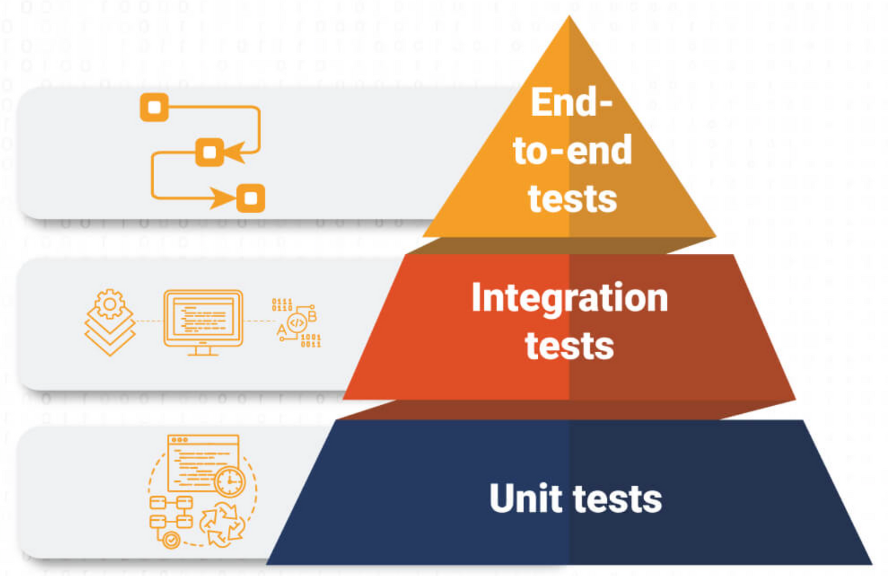

# React Part 7

## Description

- 本篇笔记是根据Justin老师 Lecture 22 React Part7 的课堂内容整理的随堂笔记。
- 参考资料：https://www.canva.com/design/DAGKuTUZztM/Brf7Iip1yOzS7JvM2cDOIQ/view?utm_content=DAGKuTUZztM&utm_campaign=designshare&utm_medium=embeds&utm_source=link
- React Testing Library: https://github.com/JustinHu8/react-7-unit-test.git

## Table of Contents

- [1. Why do we need testing?](#1-why-do-we-need-testing)
- [2. Types of testing](#2-types-of-testing)
- [3. Importance of Testing](#3-importance-of-testing)
- [4. React Component Testing](#4-react-component-testing)
  - [Tools](#tools)
- [5. Jest](#5-jest)
- [6. React Application Testing](#6-react-application-testing)
- [7. Mocking API Calls](#7-mocking-api-calls)
- [8. Code Examples and Hands-on Exercise](#8-code-examples-and-hands-on-exercise)
  - [8.1. Using Basic Test Assertions and Matchers](#81-using-basic-test-assertions-and-matchers)
  - [8.2. Testing Components with Props and State](#82-testing-components-with-props-and-state)
  - [8.3. Mocking Functions and Events](#83-mocking-functions-and-events)
  - [8.4. Testing Forms and Inputs](#84-testing-forms-and-inputs)
  - [8.5. Mocking API Calls](#85-mocking-api-calls)
  - [8.6. Global State Testing](#86-global-state-testing)
  - [8.7. Routing Testing](#87-routing-testing)

## 1. Why do we need testing?

- Ensure code reliability.

- Detect and fix bugs early.

- Improve software quality.

## 2. Types of testing

- Unit Testing: Testing individual components in isolation.

- Integration Testing: Testing how multiple components interact.

- End-to-End Testing: Testing the entire application from the user's perspective.

## 3. Importance of Testing

- **Code Quality Assurance:**
  - Catch bugs early, leading to more stable software.

- **Team Collaboration and Project Maintainability:**
  - Tests make the codebase easier to refactor and maintain.

- **Testing in CI/CD:**
  - Automated tests as part of Continuous Integration (CI) and Continuous Delivery (CD) pipelines to ensure stability.

## 4. React Component Testing

### Tools

- **使用Jest进行基础测试：**
  - 对React组件进行单元测试。
  - 编写简单测试以确保组件正确渲染。

- **使用React Testing Library测试组件交互：**
  - 测试用户如何与组件交互。
  - 模拟用户事件（点击、输入）验证组件行为。

## 5. Jest

**Key Jest Methods Explanation:**

- **test()**: The basic method used to define a test case.
- **expect()**: The method to set up an assertion.
- **render()**: From `@testing-library/react`, used to render components in a test environment.
- **fireEvent()**: Simulates user actions like clicks, form submissions, etc.
- **jest.fn()**: Used to mock functions in tests.
- **waitFor()**: Utility for handling asynchronous actions like API calls.
- **toMatchSnapshot()**: Jest method for snapshot testing, comparing UI output to saved snapshots.
- **toHaveBeenCalledTimes()**: Jest matcher to assert how many times a mock function was called.

## 6. React Application Testing

- **Routing Testing:**
  - Test navigation between different pages in your React app.

- **Global State Testing:**
  - Test global state management using Context or Redux.
  - Verifying that state updates and flows correctly between components.

## 7. Mocking API Calls

### Why Mock API Calls?
Avoid real API calls during tests to:
- Speed up tests
- Avoid external dependencies

### How to Mock API Calls in Jest:
Use Jest’s mocking functionality to simulate API responses.

## 8. # Code Examples and Hands-on Exercise

#### 8.1. Using Basic Test Assertions and Matchers
Learn the basics of writing assertions using Jest. This includes methods like `expect`, `toBe`, `toEqual`, and more complex matchers to validate the outcomes of your tests. Basic assertions help confirm that components behave as expected under different conditions.

#### 8.2. Testing Components with Props and State
Explore testing React components with different prop values and internal states. This involves verifying that components render correctly with varied props and state, ensuring reliable UI behavior.

#### 8.3. Mocking Functions and Events
Mock functions are used to simulate behavior and interactions without relying on actual implementations. You'll learn to mock functions, track calls, and simulate events like clicks or form submissions to test component responses.

#### 8.4. Testing Forms and Inputs
Forms and input fields are a critical part of user interaction. This exercise covers testing form handling, validation, and submission processes to ensure accurate user data handling and feedback mechanisms.

#### 8.5. Mocking API Calls
Mocking API calls allows tests to run faster and independently of external services. You will use Jest’s mocking tools to simulate API responses, verifying how components handle data fetching, errors, and loading states without actually making network requests.

#### 8.6. Global State Testing
When using global state management libraries like Redux or Context API, it's essential to test how state changes propagate through components. This exercise focuses on ensuring global state updates correctly and is accessible by all components that rely on it.

#### 8.7. Routing Testing
Testing routing involves ensuring that users can navigate between pages as intended. You'll simulate navigation in your tests, verify that the correct components are rendered for specific routes, and ensure any required data fetching or redirection works seamlessly.
