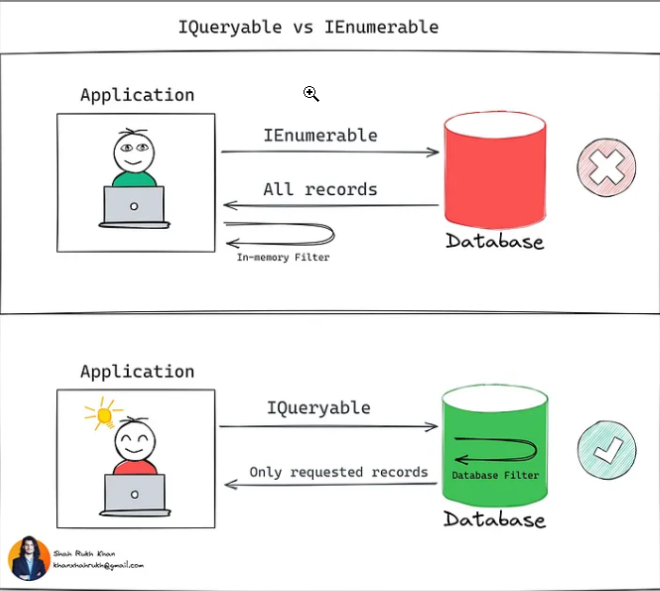

# .NET Part 9

## Description

- 本篇笔记是根据Peng Dai老师 Lecture 23 .NET Part9 的课堂内容整理的随堂笔记。
- 参考资料：https://www.canva.com/design/DAGWJIMZSnk/Z24bL6j6Tu2seCkF_uwvZQ/view?utm_content=DAGWJIMZSnk&utm_campaign=designshare&utm_medium=embeds&utm_source=link

## Table Of Content
- [1. Preparation Knowledge of C# Collection](#1-preparation-knowledge-of-c-collection)
  - [1.1. Generic Type](#11-generic-type)
    - [示例代码](#示例代码)
    - [泛型约束（Generic Constraints）](#泛型约束generic-constraints)
- [2. Categories in C# Collection](#2-categories-in-c-collection)
  - [2.1. Sequential Storage](#21-sequential-storage)
    - [Array](#array)
    - [ArrayList](#arraylist)
    - [IList<T>](#ilistt)
  - [2.2. Chain Storage Type](#22-chain-storage-type)
    - [LinkedList](#linkedlist)
    - [Queue and Stack](#queue-and-stack)
  - [2.3. Data Set Storage Type](#23-data-set-storage-type)
    - [HashSet](#hashset)
    - [SortedSet](#sortedset)
  - [2.4. Key Value Storage Type](#24-key-value-storage-type)
    - [HashTable](#hashtable)
    - [Dictionary](#dictionary)
    - [SortedDictionary](#sorteddictionary)
    - [Lookup](#lookup)
- [3. Interfaces for Collection](#3-interfaces-for-collection)
  - [3.1. IEnumerable and Enumerator](#31-ienumerable-and-enumerator)
    - [Deferred Execution](#deferred-execution)
    - [Lazy Loading](#lazy-loading)
    - [Load Related Data](#load-related-data)

## 1. Preparation Knowledge of C# Collection

### 1.1. Generic Type

### 定义 - “类型的参数”
- 编写代码时不指定具体数据类型
- 声明一个类、结构、接口或方法，并使用一个占位符表示数据类型
- 举例 - 对下面对泛型类 `GenericType<T>` 实例化过程中，`float`、`ExampleClass` 和 `ExampleStruct` 就是类型参数的具体值

#### 示例代码
```csharp
GenericList<float> list1 = new GenericList<float>();
GenericList<ExampleClass> list2 = new GenericList<ExampleClass>();
GenericList<ExampleStruct> list3 = new GenericList<ExampleStruct>();
```

#### 示例：没有泛型支持的代码重复
```csharp
public static void ShowInt(int iParameter)
{
    Console.WriteLine("This is {0}, parameter={1}, type={2}",
        typeof(CommonMethod).Name, iParameter.GetType().Name, iParameter);
}

/// <summary>
/// 打印个 string 值
/// </summary>
/// <param name="sParameter"></param>
public static void ShowString(string sParameter)
{
    Console.WriteLine("This is {0}, parameter={1}, type={2}",
        typeof(CommonMethod).Name, sParameter.GetType().Name, sParameter);
}

/// <summary>
/// 打印个 DateTime 值
/// </summary>
/// <param name="dtParameter"></param>
public static void ShowDateTime(DateTime dtParameter)
{
    Console.WriteLine("This is {0}, parameter={1}, type={2}",
        typeof(CommonMethod).Name, dtParameter.GetType().Name, dtParameter);
}
```

#### 泛型约束（Generic Constraints）

#### 定义
- 泛型约束：规定了类型参数必须满足的条件
  - 由编译器检查并保证类型安全

#### 约束的种类 - 例如：
| 约束      | 说明                                                   |
|-----------|--------------------------------------------------------|
| `T: 结构` | 类型参数必须是值类型                                    |
| `T: 类`   | 类型参数必须是引用类型，也适用于任何类、接口、委托或数组类型 |
| `T: new()` | 类型参数必须具有无参数的公共构造函数。与其他约束一起使用时，`new()` 约束必须最后指定 |
| `T: <基类名>` | 类型参数必须是指定的基类或派生类                      |
| `T: <接口名称>` | 类型参数必须实现指定的接口。可以指定多个接口约束。约束接口也可以是泛型的 |

#### 支持
- 多个约束
- 多参数约束
- 无约束 `unbounded type`
- `Type` 作为约束条件 - 限制方法参数类型

#### 示例代码
```csharp
public class List<T>
{
    public void Add<U>(List<U> items) where U : T { /*...*/ }
}
```
## 2. Categories in C# Collection

### 2.1. # Sequential Storage

#### Array
- 顺序存放
- 查询快速
- 定长 - 可以用索引/下标访问
- 适合场景 - 仅用于大部分时候读取的数据

#### 示例代码
```csharp
int[] intArray = new int[];
var people1 = new People[5];
var people = new SpecificType[10];
```
#### ArrayList

- 顺序存放
- 查询快速
- 不定长
- 可以存放各种数据类型
- 装箱和拆箱操作

```csharp
ArrayList intArrayList = new ArrayList();
intArrayList.Add(3);
intArrayList.Add(4);
intArrayList.Add("5");

intArrayList[3] = 1; // 会引发异常 System.ArgumentOutOfRangeException
```

#### IList<T>
- 解决上述 ArrayList 的类型不安全问题
- 只存放同类型数据

#### 示例代码
```csharp
public class MyList<T> : IList<T>
{
    // Implementation of IList<T>
}
```

### 2.2. # Chain Storage Type

## LinkedList

## Queue and Stack (also can be implemented by LinkedList)
- 需要临时存储信息时，队列和堆栈非常有用
- 希望在检索元素值后放弃元素

### Queue (先进先出)
- `Enqueue`：将元素添加到 Queue 末尾
- `Dequeue`：从 Queue 开头删除最早的元素
- `Peek`：返回最早的元素，但不从 Queue 中删除

### Stack (后进先出)
- `Peek`：返回位于 Stack 顶部的对象，但不将其移除
- `Pop`：删除并返回 Stack 顶部的对象
- `Push`：在 Stack 顶部插入一个对象

### 2.3. Data Set Storage Type

#### HashSet (System.Collections.Generic)
- 必须指定类型
- 确保唯一 - 输出无序
- 特有操作 - 无需遍历，操作快速
  - `SymmetricExceptWith` (补集)
  - `UnionWith` (并集)
  - `ExceptWith` (差集)
  - `IntersectWith` (交集)

#### 示例代码
```csharp
HashSet noTypeHashSet = new HashSet();
HashSet<string> hashStringSet = new HashSet<string>();
```

#### SortedSet
- **类似于 HashSet 并提供自动排序**：SortedSet 和 HashSet 类似，但 SortedSet 自动对元素进行排序。
- **确保唯一**：SortedSet 中的元素也是唯一的，但输出是有序的。
- **特有操作**：支持交集、差集、并集和补集等操作。
- **主要差别**：
  - **内存中的存储方式**：HashSet 使用哈希表 (`hash-table`)，而 SortedSet 使用红黑树 (`red-black tree`)。
  - **读取速度**：
    - **HashSet** 的读取速度为 O(1)，因为它使用哈希表。
    - **SortedSet** 的读取速度为 O(log n)，因为它使用红黑树。

### 2.4. Key Value Storage Type

#### HashTable
- **支持存储不同类型的 Key-Value 且不定长**：可以存储任意类型的键值对，且大小可动态变化。
- **通过 Key Indexer 读取/添加 Value**：可以使用键作为索引来访问或添加值。
- **无序**：元素的存储顺序与添加顺序可能不一致。
- **读取、增删操作快速**。

#### 内存中的存储
- **Index = hashFunc(key)**：通过哈希函数计算键的索引位置。
- **思考：相同 Index 怎么办？**：可能需要处理哈希冲突。

#### 其他特性
- **额外的数组保存 Index**：为了减少冲突，会用更多的空间进行存储。
- **装箱拆箱**：由于键值可以是不同类型，会产生装箱和拆箱操作，略微影响性能。
- **支持线程安全**：
  - `Hashtable.Synchronized(hashtable)`：保证 `Hashtable` 线程安全，仅允许一个写入操作。
  - 使用 `lock` 确保遍历操作（enumeration）线程安全。

#### 示例代码
```csharp
var myCollection = new Hashtable();
lock (myCollection.SyncRoot)
{
    foreach (object item in myCollection)
    {
        // 插入你的代码
    }
}
```

#### Dictionary
- **指定类型（泛型），不定长**：需要指定键和值的类型，且大小可以动态变化。
- **通过 Key Indexer 读取/添加 Value**：可以使用键作为索引来访问或添加值。
- **读取/修改速度快**：操作性能高效。

#### SortedDictionary
- **自动排序**：键值对会按照键的顺序自动排序，但会损失一些性能。

#### 允许 Key 重复的存储结构 Lookup
- **指定类型**：需要定义键和值的类型。
- **没有构造函数**：不能直接实例化 `Lookup`，需要从集合转换。
- **从 ToLookup() 方法获取实例**：可以通过 `ToLookup()` 方法从现有集合创建 `Lookup` 实例。
- **与 ToDictionary() 方法比较**：
  - `ToDictionary()` 方法会在键重复时报错。
  - `ToLookup()` 方法不会丢失重复键的数据，允许同一键对应多个值。

## 3. Interfaces for Collection

- **ICollection, ISet, IDictionary, IEnumerable**
  - **Following the principle – Interface Segregation**: Adheres to the interface segregation principle, ensuring interfaces are specific to the needs of different collection types.
  - **Interface Inheritance**: Supports inheritance among interfaces, allowing for flexible and reusable collection behavior.
  - **Explicit Interface Implementation**: Allows for explicit implementation of interface methods, providing control over how collection behaviors are accessed and modified.

### 3.1. IEnumerable and Enumerator

- **Introduction to IEnumerable**
  - **What is Iteration** - 迭代：The process of accessing each element in a collection one by one.
  - **What is Enumerator** - 迭代器 (Iterator)：An object that enables iteration over a collection.
  - **Iterator Similar to Cursor in Database**：Works similarly to a cursor in database operations, allowing traversal through data.
  - **In .NET, Named Enumerator**：In .NET, the iterator is referred to as an "Enumerator."
  - **Iterator Pattern**：A common design pattern for sequentially accessing complex elements without exposing the underlying structure.

- **Yield**：A keyword in C# that simplifies the implementation of iterators by allowing values to be returned one at a time.

- **Defined in Different Namespaces**
  - `IEnumerable` is in `System.Collections`
  - `IQueryable` is in `System.Linq`

- **Used in Different Scenarios**
  - `IEnumerable` is typically used for in-memory data collection traversal.
  - `IQueryable` is often used for querying data from external data sources, like databases, with deferred execution.



- **Deferred Execution**
  - The execution of queries is deferred, meaning it happens only when the enumerator is iterated over.

- **Lazy Loading != Deferred Execution**
  - Lazy Loading and Deferred Execution are not the same.
  - Applies regardless of `IEnumerable` and `IQueryable`.
  - **Lazy Loading** is an ORM concept, commonly used in Entity Framework.
  - Lazy Loading is implemented by proxy types, generated by the Entity Framework (EF) object materializer. This is not a feature of `IEnumerable<T>` or `IQueryable<T>`.

### Load Related Data

#### Three Common O/RM Patterns Used to Load Related Data

1. **Eager Loading**
   - Related data is loaded from the database as part of the initial query.
   - Use the `Include` method to specify related data to be included.

2. **Explicit Loading**
   - Related data is explicitly loaded from the database at a later time.
   - Explicitly load a navigation property via the `DbContext.Entry(...).Reference(...).Load()` or `DbContext.Entry(...).Collection(...).Load()` API.

3. **Lazy Loading**
   - Related data is transparently loaded from the database when the navigation property is accessed.
   - Typically enabled by configuring navigation properties as virtual in Entity Framework, allowing them to be automatically loaded when accessed.

### Lazy Loading

#### Lazy Loading with Proxies
- **Requirement**: The `virtual` keyword must be applied to navigation properties in the entity class.
  - This allows Entity Framework to create a proxy class that overrides these properties.
  - When a navigation property is accessed, the proxy intercepts the call and automatically loads the related data from the database if it hasn't been loaded already.

#### Lazy Loading without Proxies
- **Approach**: By injecting the `ILazyLoader` service into the entity.
  - Entity Framework Core provides the `ILazyLoader` service to support lazy loading without proxies.
  - This can be achieved by adding an `ILazyLoader` field in the entity class and using it to load navigation properties on demand.
  - This method is useful when proxies are not desirable, such as in cases where lightweight or custom models are required.
  - Example usage:
    ```csharp
    private readonly ILazyLoader _lazyLoader;
    public MyEntity(ILazyLoader lazyLoader) => _lazyLoader = lazyLoader;

    private RelatedEntity _relatedEntity;
    public RelatedEntity RelatedEntity
    {
        get => _lazyLoader.Load(this, ref _relatedEntity);
        set => _relatedEntity = value;
    }
    ```
  - This approach provides more control over when and how related data is loaded, allowing for customized lazy loading behavior.

